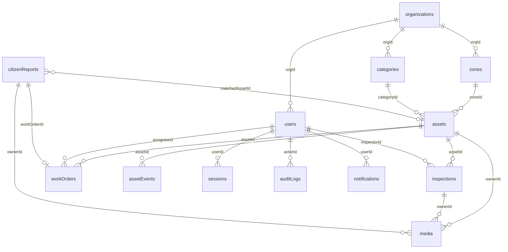

# Assetly: MongoDB Database Architecture

**Database:** `assetly` (MongoDB 7, Atlas replica set) · **ODM:** Mongoose 8
**Companion to:** `Infrastructure_Asset_Inventory_PRD_TRD_v2.md` (section 12). This file is the detailed, per-collection reference.
**Collections:** 15 (the 14 from the TRD plus `idempotencyKeys`, which the build prompt requires for safe offline retries).

## Contents
1. Global conventions
2. Collection map and relationships
3. Collection specifications (1 to 15)
4. Denormalisation map
5. Transactions
6. Access patterns → indexes
7. RBAC scope fields per collection
8. Retention and lifecycle
9. Capacity estimate and scaling
10. Validation strategy and checklist

---

## 1. Global Conventions

| Topic | Rule |
|-------|------|
| Naming | Collections plural camelCase (`workOrders`); fields camelCase; enum values snake_case or lowercase |
| Primary key | `_id: ObjectId` everywhere except `counters` (string `_id`) |
| Tenancy | Every tenant document carries `orgId: ObjectId`. **Every index used by tenant queries starts with `orgId`** |
| Timestamps | `createdAt`, `updatedAt` (Mongoose `timestamps: true`), stored as UTC `Date` |
| Geo | GeoJSON, coordinates in **[longitude, latitude]** order, `2dsphere` index |
| Soft delete | `archivedAt: Date \| null`. Queries default to `archivedAt: null`. Append-only collections never delete |
| References | ObjectId reference (no DB-level foreign keys); existence checked in the service layer |
| Money | Stored as `Number` in the organisation's currency (INR), two decimals, validated `>= 0` |
| Enums | Enforced by Mongoose `enum` and optional `$jsonSchema` validators |
| Strings | Trimmed; emails lowercased; max lengths enforced (name 120, description 2000, notes 2000) |
| Unbounded arrays | Forbidden. Embedded arrays are capped in the service (limit shown per collection) |
| Sensitive fields | `passwordHash`, `tokenHash` use `select: false` and are never returned by APIs |
| Write concern | `w: "majority"`, `retryWrites: true`, `readConcern: "majority"` inside transactions |

**Legend for field tables:** ✱ = required · 🔑 = indexed · 🆔 = unique

---

## 2. Collection Map and Relationships



| From → To | Cardinality | Stored as | Reason |
|-----------|-------------|-----------|--------|
| organization → zones, users, categories | 1 : N | `orgId` on child | Tenant boundary |
| zone → assets | 1 : N | `zoneId` on asset | Scope filter and reporting |
| category → assets | 1 : N | `categoryId` + denormalised `categoryKey` | Dynamic specs; fast filtering |
| asset → inspections | 1 : N (unbounded) | `assetId` on inspection | Separate collection to avoid document growth |
| asset → workOrders | 1 : N (unbounded) | `assetId` on work order | Independent lifecycle and queries |
| asset → assetEvents | 1 : N (unbounded) | `assetId` on event | Append-only timeline |
| work order → logs, comments, checklist | 1 : few | **Embedded**, capped | Always read together, bounded |
| asset → health, lastInspection | 1 : 1 | **Embedded** (denormalised) | Read on every list and map call |
| user → sessions | 1 : N | `userId` on session | TTL cleanup, revocation by family |
| report → asset, work order | N : 1 | `matchedAssetId`, `workOrderId` | Set after matching |
| media → owner | N : 1 | `ownerType` + `ownerId` (polymorphic) | One metadata store for all files |

---

## 3. Collection Specifications

### 3.1 `organizations`
**Purpose:** The tenant (city, municipality, company). Holds organisation-wide settings.
**Growth:** Tiny (one per tenant). **Written by:** Admin/setup, seed. **Read:** on login and settings load.

| Field | Type | Req | Default | Constraints / Notes |
|-------|------|:---:|---------|---------------------|
| `name` | String | ✱ | | 2 to 120 chars |
| `slug` 🆔 | String | ✱ | | lowercase, `[a-z0-9-]`, unique |
| `status` | String | ✱ | `active` | `active`, `suspended` |
| `settings.timezone` | String | | `Asia/Kolkata` | IANA timezone |
| `settings.currency` | String | | `INR` | ISO 4217 |
| `settings.defaultInspectionDays` | Number | | `180` | 1 to 3650 |
| `settings.reportMatchRadiusM` | Number | | `50` | 5 to 500 |
| `settings.publicReportsEnabled` | Boolean | | `true` | Toggles citizen reporting |
| `settings.engineerMoveLimitM` | Number | | `25` | Max location change an Engineer may make |
| `createdAt`, `updatedAt` | Date | ✱ | now | |

**Indexes:** `{ slug: 1 }` unique.
**Example:**
```json
{ "_id": "665a01...", "name": "Demo City", "slug": "demo-city", "status": "active",
  "settings": { "timezone": "Asia/Kolkata", "currency": "INR", "defaultInspectionDays": 180,
                "reportMatchRadiusM": 50, "publicReportsEnabled": true, "engineerMoveLimitM": 25 } }
```

---

### 3.2 `zones`
**Purpose:** Wards or operational areas. The unit of access scope for Supervisor and Engineer.
**Growth:** Small (tens to hundreds).

| Field | Type | Req | Default | Constraints / Notes |
|-------|------|:---:|---------|---------------------|
| `orgId` 🔑 | ObjectId → organizations | ✱ | | |
| `name` | String | ✱ | | 2 to 80 chars |
| `code` | String | ✱ | | Short code, e.g. `W03`; unique per org |
| `boundary` | GeoJSON Polygon | | `null` | Optional; valid closed ring; used to assign zone from coordinates |
| `isActive` | Boolean | ✱ | `true` | Inactive zones cannot receive new assets |
| `createdAt`, `updatedAt` | Date | ✱ | now | |

**Indexes:** `{ orgId: 1, code: 1 }` unique · `{ boundary: "2dsphere" }` (sparse)
**Rules:** Zone cannot be deactivated while it has non-archived assets unless they are reassigned. Only Admin manages zones.

---

### 3.3 `users`
**Purpose:** All accounts (staff and citizens), role, zone assignment, security state.
**Growth:** Small to medium. **Read:** every authenticated request (cached 60 s).

| Field | Type | Req | Default | Constraints / Notes |
|-------|------|:---:|---------|---------------------|
| `orgId` 🔑 | ObjectId | ✱ | | Citizens belong to the org they registered under |
| `name` | String | ✱ | | 2 to 80 |
| `email` 🆔 | String | ✱ | | Lowercase, validated, **globally unique** |
| `passwordHash` | String | ✱* | | `select:false`; bcrypt/argon2. *Not set while `status = invited` |
| `role` 🔑 | String | ✱ | | `admin`, `supervisor`, `engineer`, `auditor`, `citizen` |
| `zoneIds` | [ObjectId → zones] | cond. | `[]` | **Required and non-empty for supervisor and engineer**; ignored for others |
| `status` 🔑 | String | ✱ | `active` | `invited`, `active`, `deactivated` |
| `tokenVersion` | Number | ✱ | `0` | Incremented on role change, deactivation, forced logout |
| `phone` | String | | | Optional E.164 |
| `preferences.language` | String | | `en` | `en`, `hi`, `kn` |
| `inviteTokenHash` | String | | | `select:false`; set while invited |
| `inviteExpiresAt` | Date | | | |
| `failedLoginCount` | Number | | `0` | Reset on success |
| `lockedUntil` | Date | | | Login blocked until this time |
| `lastLoginAt` | Date | | | |
| `createdBy` | ObjectId → users | | | |
| `createdAt`, `updatedAt` | Date | ✱ | now | |

**Indexes:** `{ email: 1 }` unique · `{ orgId: 1, role: 1, status: 1 }` · `{ orgId: 1, zoneIds: 1 }`
**Rules:**
- Last active Admin in an org cannot be demoted or deactivated (checked in a transaction).
- A user cannot change their own role or status.
- Every zone in `zoneIds` must belong to the same `orgId`.
- Any change to `role`, `zoneIds`, or `status` bumps `tokenVersion` and revokes sessions.

---

### 3.4 `sessions`
**Purpose:** Refresh-token records for rotation, reuse detection, and revocation.
**Growth:** Bounded by TTL. **Read/Write:** every login and refresh.

| Field | Type | Req | Default | Constraints / Notes |
|-------|------|:---:|---------|---------------------|
| `userId` 🔑 | ObjectId → users | ✱ | | |
| `orgId` | ObjectId | ✱ | | |
| `tokenHash` 🔑 | String | ✱ | | SHA-256 of the refresh token; the raw token is never stored |
| `familyId` | String (UUID) | ✱ | | Groups a rotation chain; reuse of a revoked token revokes the whole family |
| `userAgent` | String | | | Trimmed to 255 |
| `ip` | String | | | |
| `expiresAt` 🔑 | Date | ✱ | now + 7 d | TTL |
| `revokedAt` | Date | | `null` | |
| `replacedBy` | ObjectId → sessions | | | New session created on rotation |
| `createdAt` | Date | ✱ | now | |

**Indexes:** `{ tokenHash: 1 }` · `{ userId: 1, familyId: 1 }` · `{ expiresAt: 1 }` TTL (`expireAfterSeconds: 0`)

---

### 3.5 `categories`
**Purpose:** Asset types and the **dynamic attribute schema** that drives validation (backend) and forms (frontend).
**Growth:** Small.

| Field | Type | Req | Default | Constraints / Notes |
|-------|------|:---:|---------|---------------------|
| `orgId` 🔑 | ObjectId | ✱ | | |
| `key` | String | ✱ | | `road`, `streetlight`, `bridge`, `pipeline`, `drain`, `building`; unique per org; immutable after assets exist |
| `name` | String | ✱ | | Display name |
| `codePrefix` | String | ✱ | | 2 to 3 uppercase letters (`SL`); unique per org |
| `icon` | String | | `box` | Icon key for the UI |
| `defaultLifeYears` | Number | ✱ | | 1 to 200 |
| `inspectionIntervalDays` | Number | ✱ | | 1 to 3650 |
| `specSchema` | [SpecField] | | `[]` | Max 30 fields |
| `isActive` | Boolean | ✱ | `true` | |
| `createdAt`, `updatedAt` | Date | ✱ | now | |

**`SpecField` sub-document:**

| Field | Type | Req | Notes |
|-------|------|:---:|-------|
| `key` | String | ✱ | camelCase, unique within the category |
| `label` | String | ✱ | |
| `type` | String | ✱ | `number`, `text`, `select`, `date`, `boolean` |
| `unit` | String | | e.g. `W`, `m`, `mm` |
| `required` | Boolean | | default `false` |
| `options` | [String] | cond. | Required when `type = select` |
| `min`, `max` | Number | | For `number` |

**Indexes:** `{ orgId: 1, key: 1 }` unique · `{ orgId: 1, codePrefix: 1 }` unique
**Example:**
```json
{ "key": "streetlight", "name": "Streetlight", "codePrefix": "SL", "defaultLifeYears": 10, "inspectionIntervalDays": 180,
  "specSchema": [
    { "key": "wattage", "label": "Wattage", "type": "number", "unit": "W", "required": true, "min": 5, "max": 400 },
    { "key": "poleHeightM", "label": "Pole height", "type": "number", "unit": "m" },
    { "key": "bulbType", "label": "Bulb type", "type": "select", "options": ["LED", "Sodium", "CFL"] } ] }
```

---

### 3.6 `assets` (core collection)
**Purpose:** The inventory. One document per physical asset, with current state and denormalised summaries.
**Growth:** Large (10k to 1M). **Read:** every list, map, dashboard call. **Average size:** about 2 KB.

| Field | Type | Req | Default | Constraints / Notes |
|-------|------|:---:|---------|---------------------|
| `orgId` 🔑 | ObjectId | ✱ | | |
| `assetCode` 🆔 | String | ✱ | generated | `PREFIX-0000`; unique per org; immutable |
| `name` | String | ✱ | | 2 to 120 |
| `categoryId` | ObjectId → categories | ✱ | | |
| `categoryKey` 🔑 | String | ✱ | | Denormalised from category; immutable |
| `zoneId` 🔑 | ObjectId → zones | ✱ | | Only Admin can change |
| `status` 🔑 | String | ✱ | `planned` | `planned`, `acquired`, `installed`, `in_service`, `under_maintenance`, `decommissioned`, `disposed` |
| `location` 🔑 | GeoJSON Point | cond. | | **Required from `installed` onward**; `2dsphere` |
| `address` | String | | | Up to 200 |
| `installDate` | Date | cond. | | Required from `installed`; not in the future |
| `acquisitionCost` | Number | | | `>= 0` |
| `vendor` | String | | | Up to 120 |
| `expectedLifeYears` | Number | ✱ | category default | 1 to 200 |
| `specs` | Object | | `{}` | Validated against `category.specSchema`; unknown keys rejected |
| `notes` | String | | | Up to 2000 |
| `health.score` | Number | ✱ | `100` | 0 to 100 |
| `health.riskLevel` 🔑 | String | ✱ | `low` | `low`, `medium`, `high`, `critical` |
| `health.computedAt` | Date | ✱ | now | |
| `health.factors` | Object | | | `{ age, condition, openIssues, overdue, ai }` penalties, so the UI can explain the score |
| `lastInspection` | Object | | `null` | `{ inspectionId, at, rating, inspectorId, aiSeverity }` (denormalised) |
| `nextInspectionDue` 🔑 | Date | | | `lastInspection.at + category interval` (or `installDate + interval`) |
| `openWorkOrderCount` | Number | ✱ | `0` | Maintained by work order services |
| `mediaCount` | Number | | `0` | Maintained by media service |
| `retirement` | Object | cond. | | `{ reason, note, at, by }`; **required when status is `decommissioned` or `disposed`** |
| `replacedByAssetId` | ObjectId → assets | | | Optional link to replacement |
| `createdBy` | ObjectId → users | ✱ | | Used for Engineer "own" scope |
| `createdAt`, `updatedAt` | Date | ✱ | now | |
| `archivedAt` 🔑 | Date | | `null` | Soft delete (Admin only) |

**Indexes:**
```js
{ orgId: 1, assetCode: 1 }                                  // unique
{ location: "2dsphere" }
{ orgId: 1, zoneId: 1, status: 1, "health.riskLevel": 1 }   // zone scoped lists and dashboard
{ orgId: 1, categoryKey: 1, status: 1 }
{ orgId: 1, nextInspectionDue: 1 }  // partial: { status: "in_service", archivedAt: null }
{ orgId: 1, createdBy: 1, createdAt: -1 }                   // engineer "own" scope
{ name: "text", assetCode: "text", address: "text" }        // text search (Atlas Search later)
```
**Validation rules:**
- Status transitions only through the lifecycle service (see state table in TRD 16.1).
- `location` must fall inside the zone's `boundary` when the zone has one.
- Engineer edits limited to `name, address, specs, notes, location (within 25 m)`.
- `specs` validated per `specSchema` (required, type, min/max, select options).
- Never hard-deleted.

**Example:**
```json
{
  "_id": "6660b1...", "orgId": "665a01...", "assetCode": "SL-0042", "name": "MG Road Streetlight 42",
  "categoryId": "665c02...", "categoryKey": "streetlight", "zoneId": "665b03...", "status": "in_service",
  "location": { "type": "Point", "coordinates": [74.8560, 12.9141] }, "address": "MG Road, Mangaluru",
  "installDate": "2024-03-15T00:00:00Z", "acquisitionCost": 18500, "vendor": "BrightLite Pvt Ltd", "expectedLifeYears": 10,
  "specs": { "wattage": 90, "poleHeightM": 8, "bulbType": "LED" },
  "health": { "score": 58, "riskLevel": "high", "computedAt": "2026-09-28T02:00:00Z",
              "factors": { "age": 10, "condition": 16, "openIssues": 5, "overdue": 10, "ai": 3 } },
  "lastInspection": { "inspectionId": "6661c4...", "at": "2026-08-10T09:30:00Z", "rating": 3, "inspectorId": "665d05...", "aiSeverity": "low" },
  "nextInspectionDue": "2027-02-06T00:00:00Z", "openWorkOrderCount": 1, "createdBy": "665d05...",
  "createdAt": "2024-03-15T10:00:00Z", "updatedAt": "2026-09-28T02:00:00Z", "archivedAt": null }
```

---

### 3.7 `inspections`
**Purpose:** One document per inspection visit. Source of the condition rating and AI findings.
**Growth:** Large. **Average size:** about 0.6 KB.

| Field | Type | Req | Default | Constraints / Notes |
|-------|------|:---:|---------|---------------------|
| `orgId` 🔑 | ObjectId | ✱ | | |
| `assetId` 🔑 | ObjectId → assets | ✱ | | |
| `zoneId` | ObjectId → zones | ✱ | | **Copied from asset** so scoped queries need no join |
| `inspectorId` | ObjectId → users | ✱ | | |
| `rating` | Number | ✱ | | Integer 1 (failed) to 5 (excellent) |
| `notes` | String | | | Up to 2000 |
| `ai.damageType` | String | | | e.g. `pothole`, `crack`, `corrosion`, `leak`, `none` |
| `ai.severity` | String | | | `none`, `low`, `medium`, `high` |
| `ai.confidence` | Number | | | 0 to 1 |
| `ai.model` | String | | | `mock` or provider name |
| `ai.confirmedByUser` | Boolean | | | Whether the inspector accepted or edited the suggestion |
| `mediaIds` | [ObjectId → media] | | `[]` | Max 10 |
| `location` | GeoJSON Point | | | Where the inspector was; used to flag remote submissions |
| `inspectedAt` | Date | ✱ | now | Not in the future; not older than 7 days when synced from offline |
| `createdAt` | Date | ✱ | now | |

**Indexes:** `{ orgId: 1, assetId: 1, inspectedAt: -1 }` · `{ orgId: 1, zoneId: 1, inspectedAt: -1 }` · `{ orgId: 1, inspectorId: 1, inspectedAt: -1 }`
**Rules:** Engineers may edit their own inspection within 24 hours; afterwards immutable. Creation runs in a transaction with the asset update, health recompute, and event insert.

---

### 3.8 `workOrders`
**Purpose:** Maintenance tasks with assignment, progress, cost, and embedded bounded sub-lists.
**Growth:** Large.

| Field | Type | Req | Default | Constraints / Notes |
|-------|------|:---:|---------|---------------------|
| `orgId` 🔑 | ObjectId | ✱ | | |
| `code` 🆔 | String | ✱ | generated | `WO-YYYY-0000`; unique per org |
| `assetId` 🔑 | ObjectId → assets | ✱ | | |
| `zoneId` | ObjectId → zones | ✱ | | Copied from asset |
| `title` | String | ✱ | | 3 to 120 |
| `description` | String | | | Up to 2000 |
| `priority` | String | ✱ | `medium` | `low`, `medium`, `high`, `urgent` |
| `status` 🔑 | String | ✱ | `open` | `open`, `assigned`, `in_progress`, `completed`, `cancelled` |
| `source` | String | ✱ | `manual` | `inspection`, `citizen_report`, `scheduled`, `manual` |
| `sourceRef` | ObjectId | | | Inspection or report that triggered it |
| `assigneeId` 🔑 | ObjectId → users | | | Must be an active user whose `zoneIds` include the order's zone |
| `createdBy` | ObjectId → users | ✱ | | |
| `dueDate` | Date | | | Not before creation |
| `estimatedCost` | Number | | | `>= 0` |
| `actualCost` | Number | | | `>= 0`; required on completion (0 allowed) |
| `checklist[]` | `{ label, done }` | | `[]` | **Max 30** |
| `comments[]` | `{ by, at, text }` | | `[]` | **Max 50**, text up to 1000 |
| `logs[]` | `{ action, cost, by, at }` | | `[]` | **Max 50**; maintenance log entries |
| `startedAt`, `completedAt`, `cancelledAt` | Date | | | Set on transitions |
| `cancelReason` | String | cond. | | Required when cancelled |
| `createdAt`, `updatedAt` | Date | ✱ | now | |

**Status transitions:** `open → assigned → in_progress → completed`; `open|assigned|in_progress → cancelled`. Anything else returns 409.
**Indexes:**
```js
{ orgId: 1, code: 1 }                                   // unique
{ orgId: 1, assetId: 1, status: 1 }
{ orgId: 1, assigneeId: 1, status: 1, dueDate: 1 }      // "my work orders"
{ orgId: 1, zoneId: 1, status: 1, priority: 1 }         // supervisor board
{ orgId: 1, source: 1, sourceRef: 1 }                   // dedupe scheduled/report orders
```
**Idempotency rule:** scheduled orders are unique per `(assetId, source: "scheduled", dueDate day)`.

---

### 3.9 `assetEvents` (append-only)
**Purpose:** Immutable timeline of everything that happens to an asset. Powers the detail page timeline and lifecycle analytics.
**Growth:** Very large. **Repository exposes insert and read only.**

| Field | Type | Req | Notes |
|-------|------|:---:|-------|
| `orgId` 🔑 | ObjectId | ✱ | |
| `assetId` 🔑 | ObjectId → assets | ✱ | |
| `zoneId` | ObjectId | ✱ | Copied for scoped reads |
| `type` | String | ✱ | See table below |
| `actorId` | ObjectId → users \| null | | `null` for system and jobs |
| `actorRole` | String | | Snapshot at time of event |
| `data` | Object | | Type-specific payload |
| `at` | Date | ✱ | Event time |

**Event types and payloads:**

| `type` | `data` payload |
|--------|----------------|
| `asset.created` | `{ assetCode, status }` |
| `asset.updated` | `{ changed: ["name","specs"] }` |
| `status.changed` | `{ from, to, reason? }` |
| `inspection.logged` | `{ inspectionId, rating, aiSeverity? }` |
| `workorder.created` | `{ workOrderId, code, priority, source }` |
| `workorder.assigned` | `{ workOrderId, assigneeId }` |
| `workorder.completed` | `{ workOrderId, actualCost }` |
| `health.changed` | `{ from, to, riskFrom, riskTo }` |
| `media.added` | `{ mediaId }` |
| `report.linked` | `{ reportId, trackingCode }` |
| `asset.archived` | `{ reason }` |

**Indexes:** `{ orgId: 1, assetId: 1, at: -1 }` · `{ orgId: 1, zoneId: 1, at: -1 }`
**Rules:** Never updated or deleted; production DB user has no `update` or `remove` privilege on this collection.

---

### 3.10 `media`
**Purpose:** Metadata for uploaded files (binary content lives in disk, Cloudinary, or S3).
**Growth:** Large.

| Field | Type | Req | Default | Constraints / Notes |
|-------|------|:---:|---------|---------------------|
| `orgId` 🔑 | ObjectId | ✱ | | |
| `ownerType` 🔑 | String | ✱ | | `asset`, `inspection`, `report` |
| `ownerId` 🔑 | ObjectId | ✱ | | Polymorphic reference |
| `storageProvider` | String | ✱ | `local` | `local`, `cloudinary`, `s3` |
| `storageKey` | String | ✱ | | Provider path or key |
| `url` | String | ✱ | | Public or signed URL |
| `thumbnailUrl` | String | | | |
| `mime` | String | ✱ | | `image/jpeg`, `image/png`, `image/webp` (documents `application/pdf` for assets) |
| `sizeBytes` | Number | ✱ | | Max 5 MB (images) |
| `width`, `height` | Number | | | Images only |
| `uploadedBy` | ObjectId → users | ✱ | | Citizen uploads reference the citizen user or `null` for anonymous |
| `status` | String | ✱ | `confirmed` | `pending`, `confirmed`; unconfirmed older than 24 h are cleaned up |
| `createdAt` | Date | ✱ | now | |
| `archivedAt` | Date | | `null` | Soft delete |

**Indexes:** `{ ownerType: 1, ownerId: 1 }` · `{ orgId: 1, uploadedBy: 1, createdAt: -1 }` · `{ status: 1, createdAt: 1 }` (cleanup job)
**Rules:** Maximum 20 media per asset and 10 per inspection or report (enforced by service; `mediaCount` kept on the asset).

---

### 3.11 `citizenReports`
**Purpose:** Public issue reports, matched to assets and turned into work orders.
**Growth:** Medium.

| Field | Type | Req | Default | Constraints / Notes |
|-------|------|:---:|---------|---------------------|
| `orgId` 🔑 | ObjectId | ✱ | | |
| `trackingCode` 🆔 | String | ✱ | generated | e.g. `R-8F3K2Q`; non-guessable (6+ chars from a safe alphabet) |
| `reporterId` | ObjectId → users \| null | | `null` | Logged-in citizen, or anonymous |
| `contact` | String | | | Optional email or phone; treated as PII |
| `description` | String | ✱ | | 10 to 1000 |
| `category` | String | | | Optional hint (`road`, `light`, `water`, `drain`, `other`) |
| `mediaIds` | [ObjectId → media] | | `[]` | Max 3 |
| `location` 🔑 | GeoJSON Point | ✱ | | `2dsphere` |
| `matchedAssetId` | ObjectId → assets | | `null` | Set by matching |
| `matchDistanceM` | Number | | | Distance to the matched asset |
| `workOrderId` | ObjectId → workOrders | | `null` | |
| `status` 🔑 | String | ✱ | `received` | `received`, `matched`, `in_progress`, `resolved`, `rejected` |
| `statusHistory[]` | `{ status, at, by, note }` | | `[]` | Max 20 |
| `rejectionReason` | String | cond. | | Required when rejected |
| `ipHash` | String | | | Hashed IP for abuse control (raw IP not stored) |
| `createdAt`, `updatedAt` | Date | ✱ | now | |

**Indexes:** `{ trackingCode: 1 }` unique · `{ location: "2dsphere" }` · `{ orgId: 1, status: 1, createdAt: -1 }` · `{ orgId: 1, reporterId: 1, createdAt: -1 }` · `{ matchedAssetId: 1 }`
**Rules:** Public status endpoint returns only `status`, `statusHistory` (without staff names), and `createdAt`. Rate limited per IP. Reports within 20 m and 24 h of an existing open report for the same asset are linked as duplicates instead of creating another work order.

---

### 3.12 `auditLogs` (append-only)
**Purpose:** Security and change trail, including denied authorisation attempts.
**Growth:** Very large; TTL retention (default 2 years, configurable).

| Field | Type | Req | Notes |
|-------|------|:---:|-------|
| `orgId` 🔑 | ObjectId | ✱ | |
| `actorId` 🔑 | ObjectId \| null | | `null` for failed logins with unknown user |
| `actorRole` | String | | Snapshot |
| `action` | String | ✱ | e.g. `auth.login`, `auth.login_failed`, `asset.create`, `asset.update`, `asset.status_change`, `user.role_change`, `export.assets`, `permission.denied` |
| `outcome` | String | ✱ | `success`, `denied`, `error` |
| `entityType` | String | | `asset`, `user`, `workOrder`, ... |
| `entityId` | ObjectId | | |
| `permission` | String | | For denied events, the permission required |
| `changes` | Object | | `{ before, after }` **changed fields only**; secrets never included |
| `requestId` | String | ✱ | Correlates with server logs |
| `ipHash` | String | | |
| `userAgent` | String | | Trimmed |
| `at` 🔑 | Date | ✱ | Also the TTL field |

**Indexes:**
```js
{ orgId: 1, at: -1 }
{ orgId: 1, entityType: 1, entityId: 1, at: -1 }
{ orgId: 1, actorId: 1, at: -1 }
{ orgId: 1, outcome: 1, at: -1 }                // find denied attempts quickly
{ at: 1 }  // TTL: expireAfterSeconds = 63072000 (2 years)
```
**Rules:** Insert and read only. Audit writes are asynchronous and must never fail the user request; a failure is logged and retried once.

---

### 3.13 `counters`
**Purpose:** Atomic sequences for readable codes (`SL-0042`, `WO-2026-0117`).
**Growth:** Tiny (one document per org × sequence).

| Field | Type | Req | Notes |
|-------|------|:---:|-------|
| `_id` | String | ✱ | Pattern `<type>:<orgId>[:<year>]`, e.g. `asset:SL:665a01...`, `wo:665a01...:2026` |
| `seq` | Number | ✱ | Incremented atomically |

**Operation:** `findOneAndUpdate({ _id }, { $inc: { seq: 1 } }, { upsert: true, new: true })`. Sequences are never reused, so gaps may appear if a create fails after allocation. This is acceptable.

---

### 3.14 `notifications`
**Purpose:** In-app alerts (assignment, overdue, report updates).
**Growth:** Bounded by TTL (90 days).

| Field | Type | Req | Default | Notes |
|-------|------|:---:|---------|-------|
| `orgId` | ObjectId | ✱ | | |
| `userId` 🔑 | ObjectId → users | ✱ | | Recipient |
| `type` | String | ✱ | | `workorder.assigned`, `workorder.overdue`, `inspection.overdue`, `report.received`, `asset.critical` |
| `title` | String | ✱ | | Up to 120 |
| `body` | String | | | Up to 300 |
| `link` | String | | | In-app route, e.g. `/assets/6660b1...` |
| `refType`, `refId` | String, ObjectId | | | Source entity; used to de-duplicate |
| `readAt` | Date | | `null` | |
| `createdAt` 🔑 | Date | ✱ | now | TTL field |

**Indexes:** `{ userId: 1, readAt: 1, createdAt: -1 }` · `{ userId: 1, refType: 1, refId: 1, type: 1 }` unique-ish for de-dupe (partial on unread) · `{ createdAt: 1 }` TTL 90 days

---

### 3.15 `idempotencyKeys`
**Purpose:** Makes retried `POST` requests (offline sync, flaky networks) safe by replaying the first result.
**Growth:** Bounded by TTL (24 h).

| Field | Type | Req | Notes |
|-------|------|:---:|-------|
| `userId` | ObjectId \| null | ✱ | `null` for public endpoints (then `ipHash` scopes it) |
| `ipHash` | String | | Used when unauthenticated |
| `key` | String | ✱ | Client-supplied UUID from `Idempotency-Key` header |
| `route` | String | ✱ | e.g. `POST /assets` |
| `requestHash` | String | ✱ | Hash of the body; same key with different body returns 422 |
| `status` | String | ✱ | `processing`, `done` |
| `responseStatus` | Number | | Stored HTTP status |
| `responseBody` | Object | | Stored response (size-limited) |
| `createdAt` 🔑 | Date | ✱ | TTL field |

**Indexes:** `{ userId: 1, ipHash: 1, key: 1, route: 1 }` unique · `{ createdAt: 1 }` TTL 86400 s

---

## 4. Denormalisation Map

Duplicated data must stay consistent. This table lists every copy and who updates it.

| Copy | Source | Kept in sync by |
|------|--------|-----------------|
| `assets.categoryKey` | `categories.key` | Immutable once set; category `key` cannot change after assets exist |
| `inspections.zoneId`, `workOrders.zoneId`, `assetEvents.zoneId` | `assets.zoneId` | Set at insert. When Admin moves an asset to another zone, a transaction updates the asset **and** all its open work orders; historical inspections and events keep the old zone (they record where it was) |
| `assets.lastInspection`, `nextInspectionDue` | latest `inspections` | Inspection service (same transaction as the insert) |
| `assets.health` | computed from asset, inspections, work orders | Health service on inspection or work order change, plus nightly job |
| `assets.openWorkOrderCount` | `workOrders` | Work order service on create, complete, cancel (transaction) |
| `assets.mediaCount` | `media` | Media service on confirm and delete |
| `assetEvents.actorRole` | `users.role` | Snapshot at write time (intentionally never updated) |

A nightly reconciliation job recounts `openWorkOrderCount` and `mediaCount` and logs any drift.

---

## 5. Transactions

Used only where more than one collection must change together (requires replica set; controlled by `USE_TRANSACTIONS`).

| Operation | Collections written | Notes |
|-----------|---------------------|-------|
| Create asset | `counters`, `assets`, `assetEvents`, `auditLogs` | Counter allocation happens first; a failure may leave a gap |
| Change status / retire | `assets`, `assetEvents`, `auditLogs` | Validates transition and role inside the transaction |
| Log inspection | `inspections`, `assets`, `assetEvents`, `auditLogs` | Also recomputes health |
| Create work order | `counters`, `workOrders`, `assets` (count), `assetEvents` | |
| Complete work order | `workOrders`, `assets` (health, status, count), `assetEvents`, `auditLogs` | Restores `in_service` when no other open orders |
| Link citizen report | `citizenReports`, `workOrders`, `assets`, `assetEvents` | |
| Change user role / deactivate | `users`, `sessions`, `auditLogs` | Last-admin check inside the transaction |
| Move asset to another zone | `assets`, `workOrders`, `assetEvents`, `auditLogs` | |

Transaction settings: `readConcern: "snapshot"`, `writeConcern: { w: "majority" }`, retry on `TransientTransactionError` up to 3 times.

---

## 6. Access Patterns → Collections → Indexes

| # | Access pattern | Collection | Index used |
|---|----------------|------------|------------|
| 1 | Login by email | `users` | `email` |
| 2 | Refresh token lookup | `sessions` | `tokenHash` |
| 3 | Map viewport (bbox) for my zones | `assets` | `location` 2dsphere (+ `orgId, zoneId` filter) |
| 4 | Asset list with filters and cursor | `assets` | `orgId, zoneId, status, health.riskLevel` |
| 5 | Search by text or code | `assets` | text index / `orgId, assetCode` |
| 6 | Open asset by code (QR) | `assets` | `orgId, assetCode` |
| 7 | Nearest asset to a coordinate | `assets` | `location` 2dsphere |
| 8 | Asset timeline | `assetEvents` | `orgId, assetId, at` |
| 9 | Inspection history for an asset | `inspections` | `orgId, assetId, inspectedAt` |
| 10 | My work orders | `workOrders` | `orgId, assigneeId, status, dueDate` |
| 11 | Supervisor board | `workOrders` | `orgId, zoneId, status, priority` |
| 12 | Overdue inspections | `assets` | partial `orgId, nextInspectionDue` |
| 13 | Dashboard summary | `assets` (`$facet`) | `orgId, zoneId, status, health.riskLevel` |
| 14 | Cost trend by month | `workOrders` (`$group`) | `orgId, zoneId, status` |
| 15 | Citizen status by code | `citizenReports` | `trackingCode` |
| 16 | Denied attempts in audit log | `auditLogs` | `orgId, outcome, at` |
| 17 | Unread notifications | `notifications` | `userId, readAt, createdAt` |
| 18 | Media for an entity | `media` | `ownerType, ownerId` |
| 19 | Idempotent replay | `idempotencyKeys` | unique compound |

---

## 7. RBAC Scope Fields per Collection

The permission layer injects these fields into every query so out-of-scope data is never fetched.

| Collection | `org` scope | `zone` scope | `own` scope |
|------------|-------------|--------------|-------------|
| `assets` | `orgId` | `zoneId ∈ user.zoneIds` | `createdBy = user._id` |
| `inspections` | `orgId` | `zoneId ∈ user.zoneIds` | `inspectorId = user._id` |
| `workOrders` | `orgId` | `zoneId ∈ user.zoneIds` | `assigneeId = user._id` (or `createdBy`) |
| `assetEvents` | `orgId` | `zoneId ∈ user.zoneIds` | n/a |
| `media` | `orgId` | via owner's zone | `uploadedBy = user._id` |
| `citizenReports` | `orgId` | matched asset's zone (or nearest zone) | `reporterId = user._id` |
| `users` | `orgId` | n/a (Admin and Auditor only) | own profile |
| `auditLogs` | `orgId` | not permitted | not permitted |
| `notifications` | n/a | n/a | `userId = user._id` (always) |

Cross-tenant access returns **404**. Any `orgId` in a request body is ignored; it always comes from the token.

---

## 8. Retention and Lifecycle

| Collection | Retention | Mechanism |
|------------|-----------|-----------|
| `sessions` | 7 days after creation | TTL on `expiresAt` |
| `notifications` | 90 days | TTL on `createdAt` |
| `idempotencyKeys` | 24 hours | TTL on `createdAt` |
| `auditLogs` | 2 years, then archive | TTL on `at` (export to cold storage first in production) |
| `media` (pending) | 24 hours if unconfirmed | Cleanup job |
| `assetEvents` | Indefinite (archive after 5+ years) | Manual archive job |
| `assets`, `inspections`, `workOrders`, `citizenReports` | Indefinite; soft delete only | `archivedAt` |
| `users` | Deactivated, not deleted; citizen PII erasure on request | Anonymise `name`, `email`, `phone`, keep IDs |

**Privacy:** citizen `contact` and IP data are minimised (hashed IP, optional contact). An erasure request anonymises the citizen's user and report contact fields but keeps the report and work order for the public record.

---

## 9. Capacity Estimate and Scaling

Estimate for one large city (50,000 assets):

| Collection | Documents | Avg size | Data size |
|------------|-----------|----------|-----------|
| assets | 50,000 | 2 KB | 100 MB |
| inspections | 250,000 | 0.6 KB | 150 MB |
| workOrders | 100,000 | 1.2 KB | 120 MB |
| assetEvents | 1,000,000 | 0.4 KB | 400 MB |
| media | 400,000 | 0.4 KB | 160 MB |
| citizenReports | 60,000 | 0.8 KB | 48 MB |
| auditLogs (per year) | 5,000,000 | 0.5 KB | 2.5 GB |
| Indexes (all) | | | about 40% of data |

Working set fits in memory on an Atlas M10 (2 GB RAM) for the first year except `auditLogs`, which is rarely read.

**Scaling path:**
1. **Read scaling:** dashboards on secondaries (`secondaryPreferred`).
2. **Archival:** move old `assetEvents` and `auditLogs` to cold storage.
3. **Sharding (multi-tenant growth):** shard `assets`, `inspections`, `workOrders`, `assetEvents` on `{ orgId: 1, _id: "hashed" }` (or `{ orgId: 1, zoneId: 1 }` for one very large tenant). `2dsphere` queries stay efficient because they are always combined with `orgId`.
4. **Time-series:** if IoT sensors are added, use a MongoDB time-series collection `sensorReadings` (`timeField: ts`, `metaField: assetId`).
5. **Search:** move to Atlas Search for fuzzy text and autocomplete.

---

## 10. Validation Strategy and Checklist

**Three layers:**
1. **Request layer (Zod):** shape, types, enums, length limits, unknown keys rejected.
2. **Service layer:** business rules (lifecycle, RBAC field rules, caps on embedded arrays, `specs` against `specSchema`, zone membership, last-admin rule).
3. **Database layer:** Mongoose schemas plus (in production) `$jsonSchema` validators with `validationLevel: "strict"` for `assets`, `users`, `workOrders`; unique and TTL indexes; a least-privilege DB user (no update or delete on `assetEvents` and `auditLogs`).

**Example `$jsonSchema` (assets, abbreviated):**
```js
db.runCommand({ collMod: "assets", validator: { $jsonSchema: {
  bsonType: "object",
  required: ["orgId", "assetCode", "name", "categoryId", "categoryKey", "zoneId", "status", "health", "createdBy"],
  properties: {
    status: { enum: ["planned","acquired","installed","in_service","under_maintenance","decommissioned","disposed"] },
    "health": { bsonType: "object", required: ["score","riskLevel"],
      properties: { score: { bsonType: "number", minimum: 0, maximum: 100 },
                    riskLevel: { enum: ["low","medium","high","critical"] } } },
    location: { bsonType: "object", properties: {
      type: { enum: ["Point"] },
      coordinates: { bsonType: "array", minItems: 2, maxItems: 2 } } },
    acquisitionCost: { bsonType: ["double","int","null"], minimum: 0 }
  } } }, validationLevel: "strict", validationAction: "error" });
```

**Pre-demo database checklist**
- [ ] All indexes created (`syncIndexes()` run) and confirmed with `db.collection.getIndexes()`
- [ ] `explain("executionStats")` shows `IXSCAN` (not `COLLSCAN`) for patterns 3, 4, 6, 8, 10, 13
- [ ] TTL indexes present on `sessions`, `notifications`, `idempotencyKeys`, `auditLogs`
- [ ] Transactions work (replica set or Atlas) or `USE_TRANSACTIONS=false` is set knowingly
- [ ] Seed data loaded: 500 assets, 5 zones, 6 categories, 5 demo users
- [ ] A cross-tenant and out-of-zone read attempt returns 404
- [ ] `assetEvents` and `auditLogs` cannot be updated or deleted through the API
- [ ] Backup or dump taken before the demo
