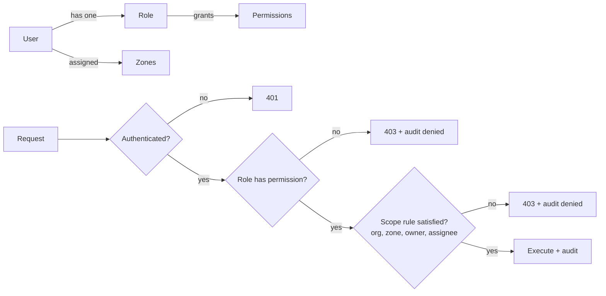
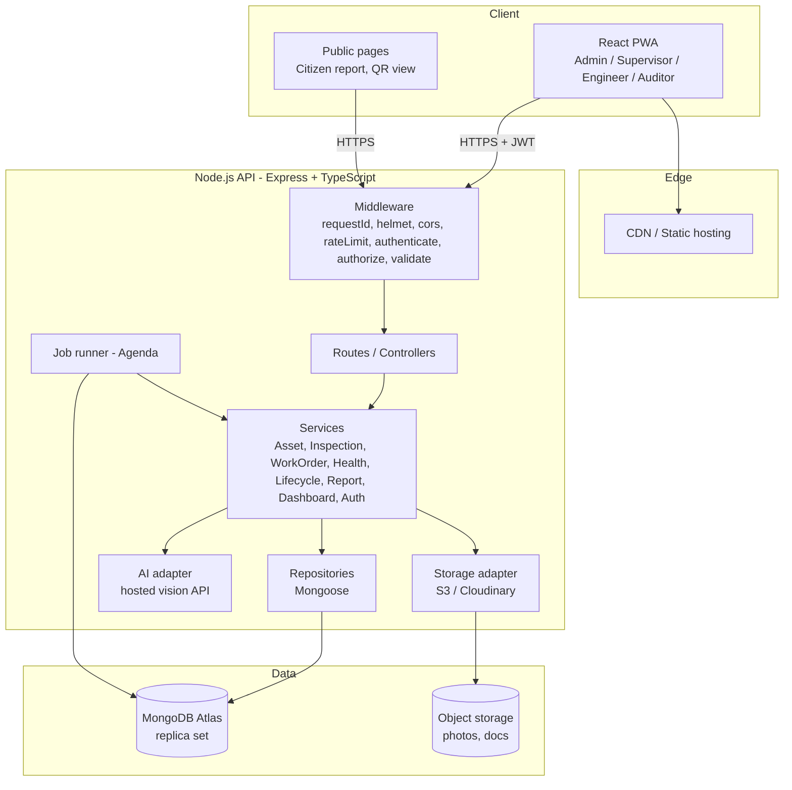
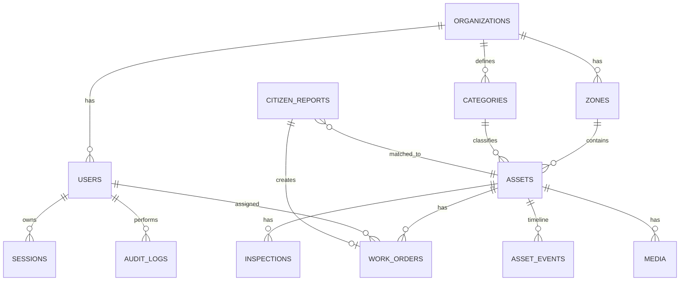
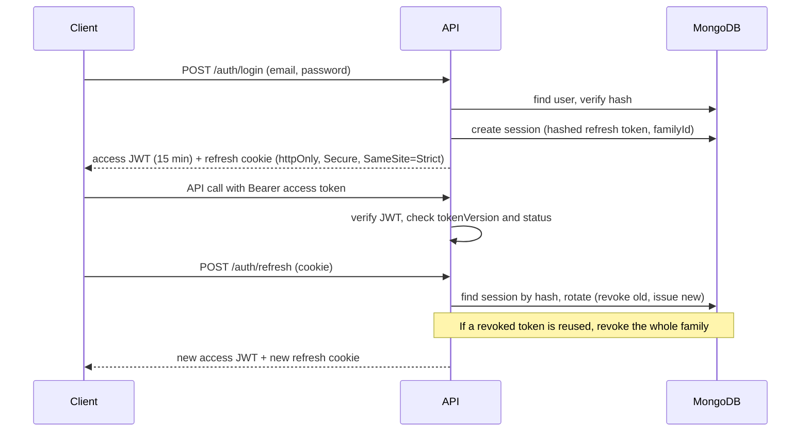
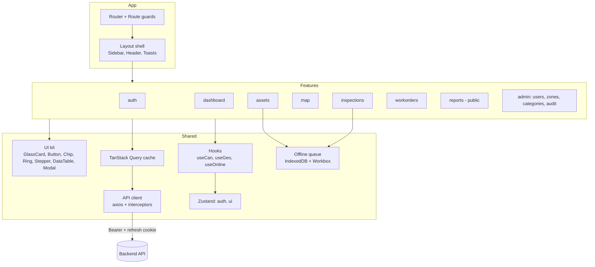

# Assetly: Infrastructure Asset Inventory & Lifecycle Platform
### PRD + TRD v2.0 (MongoDB, RBAC, Full-Stack Architecture)

**Event:** Build for Billions Hackathon (Campus Drive)
**Stack:** MongoDB Atlas · Node.js + TypeScript + Express · React + Vite + TypeScript
**Changes from v1:** PostgreSQL replaced by MongoDB; full RBAC; in-depth database, backend, and frontend architecture.

## Table of Contents
- Part A: PRD (1 to 8)
- Part B: RBAC (9)
- Part C: TRD (10 to 22): architecture, database, backend, frontend, API, core logic, security, DevOps, testing
- Part D: Delivery (23 to 26)

---

# PART A: PRODUCT REQUIREMENTS (PRD)

## 1. Overview

### 1.1 Problem
Organisations that manage roads, bridges, streetlights, pipelines, drains, and buildings track assets in spreadsheets, paper, and disconnected tools. They lack a reliable view of what they own, where it is, what condition it is in, and when it needs work. The result is duplicate or missing records, late repairs, overspending, and safety risk.

### 1.2 Vision
One real-time platform that records every asset and follows it from **planning to disposal**, with clear ownership, permissions, and history.

### 1.3 Goals
| # | Goal | Measure |
|---|------|---------|
| G1 | Single source of truth for assets | Every asset has a unique code, location, and owner zone |
| G2 | Full lifecycle tracking | Every asset has a status and an immutable event timeline |
| G3 | Move from reactive to preventive maintenance | Overdue items are visible and alerted |
| G4 | Fast field capture | Register an asset in under 60 seconds |
| G5 | Controlled access | Every action is permission-checked and audited |
| G6 | Data-driven decisions | Dashboard shows health, cost, and risk |

### 1.3 Non-Goals (MVP)
ERP or accounting integration, real IoT hardware, procurement and billing, native mobile apps (a PWA is used instead).

## 2. Users & Personas
| Persona | Description | Needs |
|---------|-------------|-------|
| **Admin** | Organisation owner or head of asset management | Everything: users, zones, categories, lifecycle approvals, reports |
| **Supervisor** | Manages a zone or ward | Assign work, approve status changes, view zone dashboard |
| **Engineer** | Field inspector or technician | Capture assets, log inspections, complete assigned work, offline use |
| **Auditor** | Compliance or finance reviewer | Read-only access to assets, history, costs, and audit logs |
| **Citizen** | Member of the public | Report issues, track own reports, scan a QR for basic asset info |

## 3. Asset Lifecycle
```
PLANNED → ACQUIRED → INSTALLED → IN_SERVICE ⇄ UNDER_MAINTENANCE → DECOMMISSIONED → DISPOSED
```
| Stage | Recorded |
|-------|----------|
| Plan & Acquire | Category, specs, cost, vendor, purchase date |
| Install & Commission | Location, photos, install date, installer |
| Operate & Monitor | Condition, incidents, usage notes |
| Inspect & Maintain | Inspections, work orders, repairs, cost |
| Assess & Predict | Health score, risk level, remaining life |
| Retire & Dispose | Reason, replacement link, disposal record |

## 4. Functional Requirements
**P0** = required for demo, **P1** = should have, **P2** = stretch.

### 4.1 Authentication & Access
| ID | Requirement | P |
|----|-------------|---|
| FR-1 | Email and password login with short-lived access token and rotating refresh token | P0 |
| FR-2 | Five roles with permission-based authorisation (see Part B) | P0 |
| FR-3 | Zone-scoped access for Supervisor and Engineer | P0 |
| FR-4 | Admin can invite, deactivate, and change roles for users | P0 |
| FR-5 | Audit log of every write and every denied action | P0 |
| FR-6 | Force logout and session revocation | P1 |

### 4.2 Asset Registry
| ID | Requirement | P |
|----|-------------|---|
| FR-7 | Create, view, edit, and archive (soft delete) assets | P0 |
| FR-8 | Unique human-readable asset code (for example `SL-0042`) and QR code | P0 |
| FR-9 | Categories with category-specific attributes (for example lamp wattage, pipe diameter) | P0 |
| FR-10 | Search and filter by category, status, risk, zone, text | P0 |
| FR-11 | Photos and documents on assets | P1 |
| FR-12 | Bulk import from CSV with row-level validation report | P1 |

### 4.3 Map (GIS)
| ID | Requirement | P |
|----|-------------|---|
| FR-13 | Interactive map with health-colored markers and category filters | P0 |
| FR-14 | Marker click opens the asset summary | P0 |
| FR-15 | Viewport-based loading (bounding box) and clustering | P1 |
| FR-16 | Nearby search ("assets within 100 m") | P1 |

### 4.4 Field Capture
| ID | Requirement | P |
|----|-------------|---|
| FR-17 | Mobile form with automatic GPS and camera | P0 |
| FR-18 | QR scan to open an asset | P1 |
| FR-19 | Offline queue with automatic sync | P2 |
| FR-20 | Multilingual UI (English, Hindi, Kannada) | P2 |

### 4.5 Inspection & Maintenance
| ID | Requirement | P |
|----|-------------|---|
| FR-21 | Log inspection with rating (1 to 5), notes, photos | P0 |
| FR-22 | Work orders: create, assign, update, complete | P0 |
| FR-23 | Work order states: open → assigned → in_progress → completed (or cancelled) | P0 |
| FR-24 | Recurring inspection schedules per category | P1 |
| FR-25 | Overdue alerts | P1 |
| FR-26 | Cost tracking per work order and per asset | P1 |

### 4.6 Lifecycle & Assessment
| ID | Requirement | P |
|----|-------------|---|
| FR-27 | Validated lifecycle transitions with mandatory reason for retirement | P0 |
| FR-28 | Automatic health score (0 to 100) and risk level | P0 |
| FR-29 | AI damage detection from a photo (type, severity, confidence) | P1 |
| FR-30 | Remaining life estimate and failure risk | P1 |

### 4.7 Citizen Reporting
| ID | Requirement | P |
|----|-------------|---|
| FR-31 | Report an issue with photo and location | P1 |
| FR-32 | Auto-match to nearest asset within 50 m and create a work order | P1 |
| FR-33 | Citizen can track own report status | P1 |
| FR-34 | Public QR page showing limited, non-sensitive asset info | P2 |

### 4.8 Dashboard & Reports
| ID | Requirement | P |
|----|-------------|---|
| FR-35 | KPI cards, condition distribution, work order status, cost trend | P0 |
| FR-36 | High-risk and overdue lists | P0 |
| FR-37 | CSV export, audit log viewer | P1 |

## 5. Non-Functional Requirements
| Category | Requirement |
|----------|-------------|
| Performance | List and map queries under 500 ms at 50k assets; page load under 3 s |
| Scalability | Stateless API; horizontal scaling; MongoDB Atlas scaling path |
| Availability | 99% for demo; Atlas replica set |
| Security | HTTPS, hashed passwords, RBAC on every route, input validation, rate limiting |
| Integrity | No hard deletes; immutable event timeline; multi-document transactions on critical writes |
| Usability | Mobile-first, large touch targets, keyboard accessible |
| Accessibility | WCAG AA contrast, reduced-motion and reduced-transparency support |
| Observability | Structured logs with request IDs, health endpoint |

## 6. Key User Flows
1. **Register asset (Engineer):** Add asset → GPS fills → choose category → category fields → photo → Save → code and QR generated → event `asset.created`.
2. **Inspect and escalate (Engineer → Supervisor):** Scan QR → inspection → AI flags damage → health drops → Supervisor creates and assigns work order.
3. **Complete work (Engineer):** Open assigned order → in progress → log action and cost → complete → health recalculated → asset back in service.
4. **Citizen report:** Public form → nearest asset matched → work order created → citizen sees status.
5. **Retire asset (Admin):** Open asset → Decommission with reason → optional replacement link → history preserved.
6. **Audit (Auditor):** Read-only view → filter audit log by user, entity, date → export.

## 7. Success Metrics
| Metric | Target |
|--------|--------|
| Time to register an asset | under 60 s |
| Seeded assets in demo | 500+ |
| Full lifecycle demo | One asset from Planned to Disposed |
| RBAC demo | Same screen shown for 3 roles with different permissions |
| Unauthorised action test suite | 100% blocked |

## 8. Risks
| Risk | Mitigation |
|------|------------|
| Scope too large | P0 first; cut list: offline mode, i18n, predictive model, CSV export |
| AI unreliable | Hosted vision API with manual severity fallback |
| Empty demo data | Seed script with realistic data |
| Poor venue internet | Local Mongo via Docker plus recorded backup demo |
| RBAC bugs | Central permission map plus automated permission tests |

---

# PART B: ROLE-BASED ACCESS CONTROL (RBAC)

## 9. RBAC Specification

### 9.1 Model
**Permission-based RBAC with scope.** Roles are bundles of permissions. Each permission is a string `resource:action`. Access is granted only when (1) the role holds the permission, and (2) the scope rule for that role is satisfied (organisation, zone, ownership, or assignment).



### 9.2 Scope Levels
| Scope | Meaning |
|-------|---------|
| `org` | All records in the user's organisation |
| `zone` | Only records whose `zoneId` is in the user's `zoneIds` |
| `own` | Only records the user created, or was assigned |
| `public` | Unauthenticated or citizen-visible, limited fields |

Every query is automatically filtered by `orgId`. Zone and own scope are injected into the Mongo filter by the permission layer, so a user can never read what they cannot access (no post-fetch filtering).

### 9.3 Permission Catalogue
```
user:read  user:invite  user:update  user:deactivate
zone:read  zone:manage
category:read  category:manage
asset:read  asset:create  asset:update  asset:archive  asset:import  asset:export
asset:status:operate      # planned → acquired → installed → in_service ⇄ under_maintenance
asset:status:retire       # → decommissioned → disposed
media:upload  media:delete
inspection:read  inspection:create  inspection:update
workorder:read  workorder:create  workorder:assign  workorder:update  workorder:complete  workorder:cancel
report:read  report:create  report:triage
dashboard:read  audit:read  ai:detect
```

### 9.4 Role → Permission Matrix
Legend: **org** = all in org, **zone** = own zones, **own** = created by me or assigned to me, **✗** = denied.

| Permission | Admin | Supervisor | Engineer | Auditor | Citizen |
|------------|:-----:|:----------:|:--------:|:-------:|:-------:|
| user:read / invite / update / deactivate | org | ✗ | ✗ | user:read (org) | ✗ |
| zone:read | org | zone | zone | org | ✗ |
| zone:manage, category:manage | org | ✗ | ✗ | ✗ | ✗ |
| category:read | org | org | org | org | ✗ |
| asset:read | org | zone | zone | org | public (limited) |
| asset:create | org | zone | zone | ✗ | ✗ |
| asset:update | org | zone | own (limited fields) | ✗ | ✗ |
| asset:archive | org | ✗ | ✗ | ✗ | ✗ |
| asset:import | org | zone | ✗ | ✗ | ✗ |
| asset:export | org | zone | ✗ | org | ✗ |
| asset:status:operate | org | zone | own (installed → in_service only) | ✗ | ✗ |
| asset:status:retire | org | ✗ (can request via work order note) | ✗ | ✗ | ✗ |
| media:upload | org | zone | zone | ✗ | own (reports) |
| media:delete | org | zone | own | ✗ | ✗ |
| inspection:read | org | zone | zone | org | ✗ |
| inspection:create | org | zone | zone | ✗ | ✗ |
| inspection:update | org | zone | own (within 24 h) | ✗ | ✗ |
| workorder:read | org | zone | own (assigned) | org | own (via report) |
| workorder:create | org | zone | zone | ✗ | ✗ |
| workorder:assign | org | zone | ✗ | ✗ | ✗ |
| workorder:update | org | zone | own (assigned) | ✗ | ✗ |
| workorder:complete | org | zone | own (assigned) | ✗ | ✗ |
| workorder:cancel | org | zone | ✗ | ✗ | ✗ |
| report:create | org | zone | zone | ✗ | ✓ |
| report:read | org | zone | zone | org | own |
| report:triage | org | zone | ✗ | ✗ | ✗ |
| dashboard:read | org | zone-filtered | own summary | org | ✗ |
| audit:read | org | ✗ | ✗ | org | ✗ |
| ai:detect | ✓ | ✓ | ✓ | ✗ | ✓ (rate-limited) |

### 9.5 Field-Level Rules
| Rule | Detail |
|------|--------|
| Engineer `asset:update` | Can edit `name`, `address`, `specs`, `notes`, `location` (within 25 m). Cannot edit `acquisitionCost`, `vendor`, `zoneId`, `status`, `health`. |
| Citizen asset view | Only `assetCode`, `name`, `category`, `status`. No cost, vendor, or coordinates beyond the public map. |
| Auditor | Sees cost fields; cannot mutate anything. |
| Supervisor | Cannot move an asset out of their zone. Only Admin changes `zoneId`. |

### 9.6 Business Rules Tied to Roles
1. Only Admin can move an asset to `decommissioned` or `disposed`; a reason is mandatory.
2. Engineer can set `installed → in_service` on assets they created; all other transitions need Supervisor or Admin.
3. A work order can only be completed by its assignee, or a Supervisor or Admin in scope.
4. Nobody can hard-delete assets, inspections, or audit logs.
5. An Admin cannot deactivate or demote the last active Admin in an organisation.
6. Users cannot change their own role.
7. Deactivating a user revokes all their sessions immediately.

### 9.7 Enforcement Design (Backend)
Single source of truth: `permissions.ts` holds the role-to-permission map and scope resolvers.

```ts
// permissions.ts (excerpt)
export const ROLE_PERMS = {
  admin:      { 'asset:read': 'org', 'asset:create': 'org', 'asset:status:retire': 'org' /* ... */ },
  supervisor: { 'asset:read': 'zone', 'asset:create': 'zone', 'workorder:assign': 'zone' /* ... */ },
  engineer:   { 'asset:read': 'zone', 'asset:update': 'own', 'workorder:update': 'own' /* ... */ },
  auditor:    { 'asset:read': 'org', 'audit:read': 'org' /* ... */ },
  citizen:    { 'report:create': 'own', 'asset:read': 'public' },
} as const;

// middleware/authorize.ts
export const authorize = (perm: Permission) => (req, res, next) => {
  const scope = ROLE_PERMS[req.user.role]?.[perm];
  if (!scope) return deny(req, res, perm, 'NO_PERMISSION');
  req.scope = buildScopeFilter(scope, req.user);   // { orgId } | { orgId, zoneId: {$in} } | { orgId, createdBy }
  next();
};

// usage
router.get('/assets', authenticate, authorize('asset:read'), assetController.list);
```

Rules:
- Services always merge `req.scope` into the Mongo filter. Repositories never accept an unscoped query for tenant data.
- `deny()` returns `403`, writes an `auditLogs` entry with `outcome: "denied"`, and never reveals whether the resource exists (use `404` for out-of-scope single-record reads).
- The JWT carries `sub`, `orgId`, `role`, `zoneIds`, `tokenVersion`. On each request the middleware also checks `tokenVersion` against the user document (cached for 60 s) so role changes and deactivation take effect quickly.

### 9.8 Enforcement Design (Frontend)
The frontend hides what the user cannot do, but is never trusted for security.

```tsx
const { can } = useCan();            // reads permissions from /auth/me
{can('workorder:assign') && <AssignButton />}
<RequirePermission perm="audit:read"><AuditPage /></RequirePermission>
```
- `/auth/me` returns the user's permission map so the UI never duplicates the matrix.
- Route guards redirect to a "No access" page (403 state) rather than a blank screen.
- Sidebar items, table row actions, and form fields are filtered by `can()`.

### 9.9 RBAC Test Cases
| # | Case | Expected |
|---|------|----------|
| 1 | Engineer calls `PATCH /assets/:id/status` to `decommissioned` | 403 and audit entry |
| 2 | Engineer reads asset in another zone | 404 |
| 3 | Supervisor updates `zoneId` on an asset | 403 |
| 4 | Auditor calls any POST, PATCH, or DELETE | 403 |
| 5 | Citizen calls `GET /assets` | 403; `GET /public/assets/:code` returns limited fields |
| 6 | Engineer completes a work order assigned to someone else | 403 |
| 7 | Admin demotes the last Admin | 409 |
| 8 | Deactivated user with a valid access token | 401 within 60 s |
| 9 | Refresh token reuse | All sessions for the user revoked |
| 10 | Tenant A user requests a Tenant B record by ID | 404 |

---

# PART C: TECHNICAL REQUIREMENTS (TRD)

## 10. System Architecture

### 10.1 Overview


### 10.2 Architecture Style
A **modular monolith**: one deployable API with strict module boundaries (each domain owns its routes, service, repository, and schema). It is fast to build, easy to deploy, and each module can later be split out. A separate AI service is optional; the AI adapter hides whether it is a hosted API or your own model.

### 10.3 Design Principles
1. Security by default: every route is denied unless explicitly authorised.
2. Scope-in-query: tenant, zone, and ownership filters are part of the database query.
3. Append-only history: the event timeline and audit logs are never updated or deleted.
4. Denormalise reads, normalise writes: computed values (health, last inspection) live on the asset for fast lists.
5. Thin controllers, fat services, dumb repositories.
6. One permission map shared by API and `/auth/me`.

## 11. Technology Stack
| Layer | Choice | Why |
|-------|--------|-----|
| Frontend | React 18, Vite, TypeScript, Tailwind CSS | Speed, type safety, matches the glassmorphism UI file |
| Server state | TanStack Query | Caching, retries, optimistic updates |
| Client state | Zustand | Small store for auth and UI |
| Forms | React Hook Form + Zod | Shared validation approach |
| Map | Leaflet + react-leaflet + OSM tiles + `leaflet.markercluster` | Free, no key |
| Charts | Recharts | Simple dashboards |
| PWA | vite-plugin-pwa (Workbox) + IndexedDB (idb) | Installable and offline queue |
| Backend | Node.js 20, Express, TypeScript | Fast development, MERN fit |
| Validation | Zod (request schemas) | One schema for runtime and types |
| ODM | Mongoose 8 | Schemas, hooks, transactions |
| Database | MongoDB Atlas (M0 for demo, M10+ later), 2dsphere indexes | Flexible category attributes and native geospatial |
| Auth | JWT (jose), argon2 or bcrypt, httpOnly refresh cookie | Standard and secure |
| Jobs | Agenda (Mongo-backed) | No Redis needed |
| Storage | Cloudinary or AWS S3 with signed uploads | Offloads binary data |
| AI | Hosted vision model behind an adapter | Damage classification |
| Logging | pino + pino-http | Structured logs |
| Docs | OpenAPI via zod-to-openapi + Swagger UI | Living API docs |
| Testing | Vitest, Supertest, mongodb-memory-server, Playwright | Full coverage |
| Deploy | Docker; Vercel (web), Render or Railway (API), Atlas (DB) | Free tiers |

---

## 12. Database Architecture (MongoDB)

### 12.1 Design Approach
| Decision | Choice | Reason |
|----------|--------|--------|
| Tenancy | Single database, `orgId` on every tenant document | Simple; indexes lead with `orgId` |
| Embed vs reference | Embed bounded, read-together data; reference unbounded or independently queried data | Fewer round trips without unbounded arrays |
| Flexible attributes | `specs` sub-document validated per category | Roads and pipes have different fields without extra tables |
| Geospatial | GeoJSON `Point` with `2dsphere` index | `$near`, `$geoWithin`, bounding-box map queries |
| History | Separate append-only `assetEvents` collection | Unbounded growth; supports timeline and analytics |
| Computed values | `health` and `lastInspection` denormalised on asset | List, map, and dashboard queries avoid joins |
| Deletes | Soft delete with `archivedAt` | Audit and referential safety |
| Consistency | Multi-document transactions for critical multi-collection writes | Health, status, and event must stay in sync |
| IDs | ObjectId `_id`; business key `assetCode` unique per org | Stable references and readable codes |

### 12.2 Collections Overview


| Collection | Purpose | Growth |
|------------|---------|--------|
| `organizations` | Tenant record | Tiny |
| `zones` | Wards or areas with optional polygon boundary | Small |
| `users` | Accounts, role, zone assignments | Small |
| `sessions` | Refresh token records (hashed) | TTL-cleaned |
| `categories` | Asset categories, spec schema, inspection interval | Small |
| `assets` | The inventory | Large |
| `inspections` | Inspection records | Large |
| `workOrders` | Maintenance tasks with embedded logs and comments | Large |
| `assetEvents` | Append-only lifecycle and activity timeline | Very large |
| `media` | File metadata (URL, owner reference) | Large |
| `citizenReports` | Public reports | Medium |
| `auditLogs` | Security and change audit trail | Very large, TTL or archive |
| `counters` | Atomic sequences for asset codes | Tiny |
| `notifications` | In-app alerts | TTL-cleaned |

### 12.3 Schemas

**organizations**
```js
{ _id, name, slug, settings: { defaultInspectionDays: 180, timezone: "Asia/Kolkata" }, createdAt }
```

**zones**
```js
{ _id, orgId, name, code, boundary: GeoJSON Polygon | null, createdAt }
```

**users**
```js
{
  _id, orgId,
  name, email (lowercase), passwordHash,
  role: "admin" | "supervisor" | "engineer" | "auditor" | "citizen",
  zoneIds: [ObjectId],             // required for supervisor, engineer
  status: "active" | "invited" | "deactivated",
  tokenVersion: Number,             // bump to invalidate access tokens
  lastLoginAt, createdAt, updatedAt
}
```

**sessions** (refresh tokens)
```js
{ _id, userId, tokenHash, familyId, userAgent, ip, expiresAt, revokedAt, replacedBy }
```

**categories**
```js
{
  _id, orgId, key: "streetlight", name: "Streetlight",
  defaultLifeYears: 10, inspectionIntervalDays: 180,
  icon: "lamp",
  specSchema: [                       // drives dynamic form and validation
    { key: "wattage", label: "Wattage", type: "number", unit: "W", required: true },
    { key: "poleHeightM", label: "Pole height", type: "number", unit: "m" }
  ]
}
```

**assets**
```js
{
  _id, orgId,
  assetCode: "SL-0042",               // unique per org
  name, categoryId, categoryKey,      // categoryKey denormalised for fast filters
  zoneId,
  status: "planned" | "acquired" | "installed" | "in_service" | "under_maintenance" | "decommissioned" | "disposed",
  location: { type: "Point", coordinates: [lng, lat] },   // GeoJSON order: lng, lat
  address,
  installDate, acquisitionCost, vendor, expectedLifeYears,
  specs: { wattage: 90, poleHeightM: 8 },                 // validated against category.specSchema
  health: { score: 82, riskLevel: "low", computedAt, factors: { age, condition, openIssues, overdue, ai } },
  lastInspection: { at, rating, inspectorId, aiSeverity },  // denormalised summary
  nextInspectionDue,
  openWorkOrderCount: 1,
  replacedByAssetId, retirement: { reason, at, by },       // only when retired
  createdBy, createdAt, updatedAt, archivedAt
}
```

**inspections**
```js
{
  _id, orgId, assetId, zoneId,        // zoneId copied so scoped queries need no join
  inspectorId, rating: 1..5, notes,
  ai: { damageType, severity, confidence, model },   // optional
  mediaIds: [ObjectId],
  inspectedAt, createdAt
}
```

**workOrders**
```js
{
  _id, orgId, assetId, zoneId,
  code: "WO-2026-0117",
  title, description,
  priority: "low" | "medium" | "high" | "urgent",
  status: "open" | "assigned" | "in_progress" | "completed" | "cancelled",
  source: "inspection" | "citizen_report" | "scheduled" | "manual",
  sourceRef: ObjectId | null,
  assigneeId, createdBy, dueDate,
  estimatedCost, actualCost,
  checklist: [{ label, done }],                       // bounded (<= 30)
  comments: [{ by, at, text }],                       // bounded (<= 50), cap enforced in service
  logs: [{ action, cost, by, at }],                   // maintenance log, bounded
  startedAt, completedAt, cancelledAt, cancelReason,
  createdAt, updatedAt
}
```

**assetEvents** (append-only)
```js
{
  _id, orgId, assetId, zoneId,
  type: "asset.created" | "asset.updated" | "status.changed" | "inspection.logged" |
        "workorder.created" | "workorder.completed" | "health.changed" | "media.added" | "report.linked",
  actorId, at,
  data: { from: "installed", to: "in_service", reason: "..." }   // type-specific payload
}
```

**media**
```js
{ _id, orgId, ownerType: "asset"|"inspection"|"report", ownerId, url, storageKey, mime, sizeBytes, uploadedBy, createdAt }
```

**citizenReports**
```js
{
  _id, orgId, trackingCode: "R-8F3K2",   // short code given to the citizen
  reporterId | null, contact,
  description, mediaIds: [ObjectId],
  location: { type: "Point", coordinates: [lng, lat] },
  matchedAssetId | null, matchDistanceM, workOrderId | null,
  status: "received" | "matched" | "in_progress" | "resolved" | "rejected",
  createdAt, updatedAt
}
```

**auditLogs**
```js
{
  _id, orgId, actorId, actorRole,
  action: "asset.update" | "auth.login" | "permission.denied" | ...,
  outcome: "success" | "denied" | "error",
  entityType, entityId,
  changes: { before: {...}, after: {...} },     // changed fields only
  requestId, ip, userAgent, at
}
```

**counters**
```js
{ _id: "SL:<orgId>", seq: 42 }      // findOneAndUpdate { $inc: { seq: 1 } }, upsert
```

### 12.4 Indexes
```js
// users
users.createIndex({ email: 1 }, { unique: true });
users.createIndex({ orgId: 1, role: 1, status: 1 });

// sessions
sessions.createIndex({ tokenHash: 1 });
sessions.createIndex({ userId: 1, familyId: 1 });
sessions.createIndex({ expiresAt: 1 }, { expireAfterSeconds: 0 });          // TTL

// assets
assets.createIndex({ orgId: 1, assetCode: 1 }, { unique: true });
assets.createIndex({ location: "2dsphere" });
assets.createIndex({ orgId: 1, zoneId: 1, status: 1, "health.riskLevel": 1 });
assets.createIndex({ orgId: 1, categoryKey: 1, status: 1 });
assets.createIndex({ orgId: 1, nextInspectionDue: 1 }, { partialFilterExpression: { status: "in_service" } });
assets.createIndex({ name: "text", assetCode: "text", address: "text" });  // or Atlas Search

// inspections
inspections.createIndex({ orgId: 1, assetId: 1, inspectedAt: -1 });
inspections.createIndex({ orgId: 1, zoneId: 1, inspectedAt: -1 });

// workOrders
workOrders.createIndex({ orgId: 1, code: 1 }, { unique: true });
workOrders.createIndex({ orgId: 1, assetId: 1, status: 1 });
workOrders.createIndex({ orgId: 1, assigneeId: 1, status: 1, dueDate: 1 });
workOrders.createIndex({ orgId: 1, zoneId: 1, status: 1, priority: 1 });

// assetEvents (timeline reads)
assetEvents.createIndex({ orgId: 1, assetId: 1, at: -1 });

// media
media.createIndex({ ownerType: 1, ownerId: 1 });

// citizenReports
citizenReports.createIndex({ trackingCode: 1 }, { unique: true });
citizenReports.createIndex({ location: "2dsphere" });
citizenReports.createIndex({ orgId: 1, status: 1, createdAt: -1 });

// auditLogs
auditLogs.createIndex({ orgId: 1, at: -1 });
auditLogs.createIndex({ orgId: 1, entityType: 1, entityId: 1, at: -1 });
auditLogs.createIndex({ orgId: 1, actorId: 1, at: -1 });
auditLogs.createIndex({ at: 1 }, { expireAfterSeconds: 60 * 60 * 24 * 730 });   // 2-year retention

// notifications
notifications.createIndex({ userId: 1, readAt: 1, createdAt: -1 });
notifications.createIndex({ createdAt: 1 }, { expireAfterSeconds: 60 * 60 * 24 * 90 });
```
Index rule: equality fields first (`orgId`, `zoneId`), then sort or range fields. Verify with `explain("executionStats")` on the seeded data.

### 12.5 Key Query Patterns
```js
// Map viewport (bounding box), scoped to the user's zones
assets.find({
  orgId, zoneId: { $in: user.zoneIds }, archivedAt: null,
  location: { $geoWithin: { $box: [[west, south], [east, north]] } },
}).project({ assetCode: 1, name: 1, categoryKey: 1, location: 1, "health.score": 1, "health.riskLevel": 1, status: 1 });

// Nearest asset to a citizen report (within 50 m)
assets.find({
  orgId, status: { $in: ["in_service", "under_maintenance"] },
  location: { $near: { $geometry: point, $maxDistance: 50 } },
}).limit(1);

// Dashboard summary (single round trip)
assets.aggregate([
  { $match: { orgId, archivedAt: null, ...scopeFilter } },
  { $facet: {
      byStatus:   [{ $group: { _id: "$status", n: { $sum: 1 } } }],
      byRisk:     [{ $group: { _id: "$health.riskLevel", n: { $sum: 1 } } }],
      byCategory: [{ $group: { _id: "$categoryKey", n: { $sum: 1 }, avgHealth: { $avg: "$health.score" } } }],
      overdue:    [{ $match: { nextInspectionDue: { $lt: new Date() }, status: "in_service" } }, { $count: "n" }],
      critical:   [{ $match: { "health.riskLevel": "critical" } }, { $sort: { "health.score": 1 } }, { $limit: 10 }],
  } },
]);

// Cost trend by month
workOrders.aggregate([
  { $match: { orgId, status: "completed", ...scopeFilter } },
  { $group: { _id: { $dateToString: { format: "%Y-%m", date: "$completedAt" } }, cost: { $sum: "$actualCost" } } },
  { $sort: { _id: 1 } },
]);
```

### 12.6 Transactions
Used only where several collections must change together (Atlas provides replica sets).

**Complete work order:**
1. Update `workOrders` (status, `completedAt`, `actualCost`, append log)
2. Insert `assetEvents` (`workorder.completed`)
3. Recompute and update `assets.health`, `openWorkOrderCount`, and status back to `in_service`
4. Insert `auditLogs`

All in one `session.withTransaction()`. The same applies to **log inspection**, **change status**, and **link citizen report**. Everything else uses single-document atomic updates.

### 12.7 Integrity & Validation
- Mongoose schemas for structure and enums; optional `$jsonSchema` validators in production for defence in depth.
- `assets.specs` is validated by the service against `category.specSchema` before save.
- Unique indexes enforce `assetCode`, `email`, and WO code.
- Array caps (`comments`, `logs`, `checklist`) enforced in the service to avoid unbounded documents (16 MB limit).
- `assetEvents` and `auditLogs` are insert-only; the repository exposes no update or delete methods, and the DB user for the API has no `remove` on these collections in production.
- Asset codes: `counters` sequence with prefix per category (`RD`, `SL`, `BR`, `PL`, `DR`, `BD`).

### 12.8 Scaling & Operations
| Topic | Approach |
|-------|----------|
| Read scaling | Atlas secondary reads for dashboards (`readPreference: secondaryPreferred`) |
| Sharding path | Shard `assets`, `inspections`, `assetEvents` on `{ orgId, _id }` hashed or `{ orgId, zoneId }` when data or tenants grow |
| Large maps | Viewport queries plus server-side clustering via `$geoWithin` and grid `$group` |
| Archival | Move old `assetEvents` and `auditLogs` to cold storage after retention |
| Backups | Atlas continuous backup (or `mongodump` for local); restore test before demo |
| Migrations | `migrate-mongo` scripts for index and schema changes |
| Search | Text index for MVP; Atlas Search for fuzzy and autocomplete later |
| Connection | Single pooled client (`maxPoolSize: 20`), `retryWrites: true`, `w: "majority"` |

---

## 13. Backend Architecture

### 13.1 Layers
```
HTTP request
  → Middleware chain
  → Route (path + permission + validation schema)
  → Controller (parse request, call service, shape response)
  → Service (business rules, transactions, events, authorisation of scope)
  → Repository (Mongoose queries only)
  → MongoDB
```

| Layer | Responsibility | Must not |
|-------|----------------|----------|
| Route | Wire path → middleware → controller | Contain logic |
| Controller | Extract input, call service, return DTO | Query the DB |
| Service | Rules, lifecycle, health, transactions, events, audit | Touch `req` or `res` |
| Repository | Scoped queries, projections, pagination | Contain business rules |
| Model | Schema, indexes | Call services |

### 13.2 Middleware Chain (order)
1. `requestId`: attach a UUID, add to logs and response header
2. `helmet`, `cors` (allow-list), `compression`
3. `pino-http`: structured logging
4. `rateLimit`: global (100/min per IP) plus stricter on `/auth/*`, `/public/*`, `/ai/*`
5. `express.json({ limit: "1mb" })` and `mongo-sanitize` (strip `$` and `.` keys to prevent NoSQL injection)
6. `authenticate`: verify JWT, load user snapshot, check `tokenVersion` and `status`
7. `authorize(permission)`: role check and scope filter (section 9.7)
8. `validate(zodSchema)`: body, query, and params
9. Controller
10. `errorHandler`: maps errors to the standard envelope

### 13.3 Folder Structure
```
backend/
├── src/
│   ├── app.ts                    # express app assembly
│   ├── server.ts                 # boot, db connect, jobs start
│   ├── config/                   # env (zod-validated), constants
│   ├── common/
│   │   ├── errors.ts             # AppError, NotFound, Forbidden, Conflict
│   │   ├── permissions.ts        # role → permission → scope map
│   │   ├── scope.ts              # buildScopeFilter()
│   │   ├── pagination.ts         # cursor helpers
│   │   └── response.ts
│   ├── middleware/               # requestId, authenticate, authorize, validate, rateLimit, errorHandler
│   ├── db/
│   │   ├── connect.ts
│   │   ├── withTransaction.ts
│   │   └── indexes.ts            # ensureIndexes()
│   ├── modules/
│   │   ├── auth/                 # routes, controller, service, schemas
│   │   ├── users/
│   │   ├── zones/
│   │   ├── categories/
│   │   ├── assets/               # + lifecycle.ts, health.ts, code.ts
│   │   ├── inspections/
│   │   ├── workorders/
│   │   ├── reports/              # citizen reports + matching
│   │   ├── media/                # signed upload URLs
│   │   ├── dashboard/
│   │   ├── audit/
│   │   └── ai/                   # adapter interface + provider
│   ├── jobs/                     # agenda definitions
│   └── scripts/seed.ts
├── tests/                        # unit, integration, rbac
├── openapi/
├── Dockerfile
└── package.json
```
Each module folder contains: `*.routes.ts`, `*.controller.ts`, `*.service.ts`, `*.repository.ts`, `*.model.ts`, `*.schemas.ts` (Zod).

### 13.4 Authentication Flow

- Access token lives in memory only (not localStorage). Refresh token is an httpOnly cookie.
- Passwords hashed with argon2id (or bcrypt cost 12). Login rate-limited with lockout backoff.

### 13.5 Domain Services
| Service | Key responsibilities |
|---------|----------------------|
| AssetService | Create with code generation and spec validation; scoped list, search, and map queries; update with field-level rules; archive |
| LifecycleService | State machine, role-aware transitions, mandatory retirement reason, event and audit writes (transaction) |
| HealthService | Compute score and risk; called by inspection, work order, and nightly job |
| InspectionService | Create inspection, update asset summary and next due date, trigger health, event |
| WorkOrderService | Create, assign (assignee must be in the asset's zone), progress, complete (transaction), comments |
| ReportService | Public submit, nearest-asset match, auto work order, tracking |
| MediaService | Issue signed upload URL; verify mime and size; save metadata |
| DashboardService | Scoped aggregations |
| AuditService | Write audit entries (async, never blocks the request path on failure) |
| AiService | Adapter: `detectDamage(image) → { type, severity, confidence }` with timeout, retry, and fallback |

### 13.6 Background Jobs (Agenda)
| Job | Schedule | Action |
|-----|----------|--------|
| `recomputeHealth` | Nightly 02:00 | Apply age and overdue penalties in batches of 500 |
| `generateScheduledWork` | Daily 06:00 | Create preventive work orders for assets past `nextInspectionDue` (idempotent by asset and date) |
| `notifyOverdue` | Daily 08:00 | Notify supervisors of overdue work orders and inspections |
| `cleanupUploads` | Daily | Remove unconfirmed uploads older than 24 h |

### 13.7 API Conventions
- Base path `/api/v1`. JSON only. Dates in ISO 8601 UTC.
- Success: `{ "data": ..., "meta": { "nextCursor": "...", "total": 120 } }`
- Error: `{ "error": { "code": "FORBIDDEN", "message": "...", "details": [...], "requestId": "..." } }`
- Cursor pagination on large lists (`?limit=25&cursor=...`), sorted by `_id` or a stable field.
- Filtering by query parameters, validated by Zod; unknown parameters rejected.
- Idempotency: `Idempotency-Key` header on `POST /assets` and `POST /public/reports` to make offline-sync retries safe.
- Status codes: 200, 201, 204, 400 (validation), 401, 403, 404, 409 (state or uniqueness conflict), 422 (business rule), 429.

### 13.8 File Upload Flow
1. Client requests `POST /media/upload-url` (permission checked, mime and size declared).
2. API returns a signed URL and `storageKey`.
3. Client uploads directly to storage (no binary through the API).
4. Client calls `POST /media` with `storageKey`; API verifies object exists, saves metadata, links to owner.
5. Reads use signed or CDN URLs.

### 13.9 AI Damage Detection
- Interface `DamageDetector { detect(imageUrl): Promise<Detection> }` with implementations `HostedVisionDetector` and `MockDetector` (used in tests and as a demo fallback).
- 8 s timeout, one retry, then return `{ status: "unavailable" }` so the UI falls back to manual severity.
- Result is a suggestion stored on the inspection; the engineer confirms.
- Severity maps to the health penalty (low 3, medium 8, high 15).

### 13.10 Error Handling & Observability
- Custom `AppError` classes map to status codes; unknown errors return a generic `500` with a `requestId`.
- Structured logs (pino) with `requestId`, `userId`, `orgId`, route, duration; secrets redacted.
- `GET /healthz` (process) and `GET /readyz` (DB reachable).
- Slow query logging above 200 ms; Atlas Performance Advisor reviewed before demo.

---

## 14. Frontend Architecture

### 14.1 Principles
1. Feature-first structure with clear boundaries.
2. Server state in TanStack Query; UI state only in Zustand.
3. Permissions come from the server; UI only reflects them.
4. Design tokens drive the glassmorphism look (from `asset-inventory-ui.html`): no hard-coded colors.
5. Mobile-first, accessible, resilient to poor networks.

### 14.2 Architecture Diagram


### 14.3 Folder Structure
```
frontend/
├── src/
│   ├── app/
│   │   ├── router.tsx            # routes + lazy loading
│   │   ├── providers.tsx         # QueryClient, Theme, i18n, Toast
│   │   └── guards/               # RequireAuth, RequirePermission
│   ├── features/
│   │   ├── auth/                 # LoginPage, useAuth, authStore
│   │   ├── dashboard/
│   │   ├── assets/               # AssetList, AssetForm, AssetDetail, LifecycleStepper, queries.ts
│   │   ├── map/                  # AssetMap, MarkerLayer, FilterChips, useViewportAssets
│   │   ├── inspections/
│   │   ├── workorders/           # Board, WorkOrderDrawer
│   │   ├── reports/              # public citizen flow
│   │   └── admin/                # Users, Zones, Categories, AuditLog
│   ├── shared/
│   │   ├── ui/                   # design-system components
│   │   ├── hooks/                # useCan, useGeolocation, useOnlineStatus, useDebounce
│   │   ├── api/                  # client.ts, endpoints, types generated from OpenAPI
│   │   ├── lib/                  # format, health colors, permissions helpers
│   │   └── offline/              # queue.ts, sync.ts
│   ├── styles/                   # tokens.css, glass.css, tailwind config
│   ├── i18n/                     # en.json, hi.json, kn.json
│   └── main.tsx
├── public/                       # manifest, icons
└── vite.config.ts
```

### 14.4 Routing & Guards
| Route | Component | Permission |
|-------|-----------|------------|
| `/login` | LoginPage | public |
| `/` | Dashboard | `dashboard:read` |
| `/map` | AssetMap | `asset:read` |
| `/assets` | AssetList | `asset:read` |
| `/assets/new` | AssetForm | `asset:create` |
| `/assets/:id` | AssetDetail | `asset:read` |
| `/scan` | QrScanner | `asset:read` |
| `/work-orders` | Board | `workorder:read` |
| `/admin/users` | Users | `user:read` |
| `/admin/zones`, `/admin/categories` | Manage | `zone:manage`, `category:manage` |
| `/admin/audit` | AuditLog | `audit:read` |
| `/report`, `/report/:code` | Citizen flow | public |
| `/a/:assetCode` | Public asset page | public |
| `/403`, `*` | No access, Not found | n/a |

Routes are code-split with `React.lazy`. `RequireAuth` restores the session via silent `/auth/refresh` on load.

### 14.5 State Management
| Kind | Tool | Examples |
|------|------|----------|
| Server state | TanStack Query | assets, work orders, dashboard, `me` |
| Client state | Zustand | access token, theme, map filters, sidebar state |
| Form state | React Hook Form + Zod | asset form, inspection form |
| URL state | Router search params | list filters, pagination, selected asset |

Query key convention: `['assets', { filters }]`, `['asset', id]`, `['dashboard', scope]`.
Mutations use optimistic updates for work order status and invalidate related keys (`asset`, `dashboard`).

### 14.6 API Client
- One axios instance with `baseURL`, `withCredentials: true`.
- Request interceptor adds the Bearer token; response interceptor handles `401` by calling `/auth/refresh` once (queue concurrent calls), then retries; on failure logs out.
- Types generated from the OpenAPI spec to keep frontend and backend in sync.
- Errors normalised into `{ code, message, fieldErrors }` for forms and toasts.

### 14.7 Dynamic Forms
The asset form reads `category.specSchema` and renders category-specific fields (number, text, select, date) with the same validation rules the backend enforces. Adding a new category needs no frontend code.

### 14.8 Map Architecture
- Leaflet with `react-leaflet`, OSM tiles, and marker clustering.
- `useViewportAssets(bounds, filters)` calls `GET /assets/map?bbox=...` on `moveend` (debounced 300 ms) and returns lightweight points.
- Marker color from `health.riskLevel` via the shared token map; critical markers pulse.
- Selecting a marker updates the URL (`?asset=id`), opening the detail panel; back button behaves naturally.

### 14.9 Offline & PWA (P2)
- Workbox precaches the shell; runtime caching for map tiles and recent asset lists (stale-while-revalidate).
- Writes made offline (new asset, inspection, photos) go into an IndexedDB queue with an `Idempotency-Key`.
- On reconnect, the queue flushes in order; conflicts (409) surface in a "needs review" list.
- A status chip shows Online, Offline, or Syncing (n).

### 14.10 Design System
- CSS variables for tokens: `--deep #0D3A35`, `--moderate #276152`, `--laurel #B1B7AB`, `--cream #FBF6F0`, plus health colors.
- Base components: `GlassCard`, `Button` (primary and ghost), `Chip`, `HealthRing`, `LifecycleStepper`, `DataTable`, `Drawer`, `Toast`, `EmptyState`, `Skeleton`.
- Glassmorphism recipe lives in one utility (`.glass`) with a fallback for `prefers-reduced-transparency`.
- Motion: KPI count-up on first load, pulse on critical markers only; respect `prefers-reduced-motion`.

### 14.11 UX States & Accessibility
- Every list and panel has loading (skeleton), empty (call to action), and error (what happened and how to retry) states.
- Permission-denied states explain what is needed rather than showing a blank page.
- Keyboard-operable map controls and pins; visible focus; icon buttons labelled; contrast AA over glass surfaces.

### 14.12 Performance
Route-level code splitting, virtualised long tables, debounced search, image lazy loading with thumbnails, marker clustering, and bundle budget of under 250 KB gzipped for the initial route.

### 14.13 Frontend Testing
Vitest and Testing Library for components and hooks (`useCan`), MSW for API mocks, Playwright for end-to-end flows per role.

---

## 15. API Specification (with permissions)

| Method | Endpoint | Permission | Notes |
|--------|----------|------------|-------|
| POST | `/auth/login` | public | Rate limited |
| POST | `/auth/refresh` | cookie | Rotates token |
| POST | `/auth/logout` | auth | Revokes session |
| GET | `/auth/me` | auth | User, role, zones, permission map |
| GET | `/users` | `user:read` | |
| POST | `/users/invite` | `user:invite` | |
| PATCH | `/users/:id` | `user:update` | Role and zone changes, last-admin rule |
| POST | `/users/:id/deactivate` | `user:deactivate` | Bumps `tokenVersion` |
| GET/POST/PATCH | `/zones` | `zone:read` / `zone:manage` | |
| GET/POST/PATCH | `/categories` | `category:read` / `category:manage` | |
| GET | `/assets` | `asset:read` | Filters: `q, category, status, risk, zone, cursor, limit` |
| GET | `/assets/map` | `asset:read` | `bbox=w,s,e,n`, returns light points |
| GET | `/assets/nearby` | `asset:read` | `lat, lng, radius` |
| POST | `/assets` | `asset:create` | Idempotency-Key supported |
| GET | `/assets/:id` | `asset:read` | Includes timeline preview |
| PATCH | `/assets/:id` | `asset:update` | Field-level rules |
| PATCH | `/assets/:id/status` | `asset:status:operate` or `asset:status:retire` | Depends on target state |
| POST | `/assets/:id/archive` | `asset:archive` | |
| GET | `/assets/:id/events` | `asset:read` | Timeline, cursor paginated |
| GET | `/assets/:id/qr` | `asset:read` | PNG |
| POST | `/assets/import` | `asset:import` | CSV, returns row report |
| GET | `/assets/export` | `asset:export` | CSV |
| POST | `/media/upload-url` | `media:upload` | Signed URL |
| POST | `/media` | `media:upload` | Confirm upload |
| DELETE | `/media/:id` | `media:delete` | Soft delete |
| POST | `/assets/:id/inspections` | `inspection:create` | Triggers health and event |
| GET | `/assets/:id/inspections` | `inspection:read` | |
| PATCH | `/inspections/:id` | `inspection:update` | Own, within 24 h |
| GET | `/work-orders` | `workorder:read` | Scope filters applied |
| POST | `/work-orders` | `workorder:create` | |
| PATCH | `/work-orders/:id` | `workorder:update` | |
| POST | `/work-orders/:id/assign` | `workorder:assign` | Assignee in zone |
| POST | `/work-orders/:id/complete` | `workorder:complete` | Transaction |
| POST | `/work-orders/:id/cancel` | `workorder:cancel` | Reason required |
| POST | `/work-orders/:id/comments` | `workorder:update` | Capped at 50 |
| POST | `/ai/detect-damage` | `ai:detect` | Multipart or media ID |
| GET | `/dashboard/summary` | `dashboard:read` | Scope aware |
| GET | `/dashboard/charts` | `dashboard:read` | |
| GET | `/audit` | `audit:read` | Filters: actor, entity, date, outcome |
| POST | `/public/reports` | public + rate limit | Returns `trackingCode` |
| GET | `/public/reports/:code` | public | Status only |
| GET | `/public/assets/:assetCode` | public | Limited fields |
| GET | `/reports` | `report:read` | Staff triage list |
| POST | `/reports/:id/triage` | `report:triage` | |
| GET | `/healthz`, `/readyz` | public | |

**Sample: create asset**
```http
POST /api/v1/assets
Authorization: Bearer <token>
Idempotency-Key: 6f1d...

{
  "name": "MG Road Streetlight 42",
  "categoryId": "665f...",
  "zoneId": "665a...",
  "location": { "type": "Point", "coordinates": [74.8560, 12.9141] },
  "address": "MG Road, Mangaluru",
  "installDate": "2024-03-15",
  "acquisitionCost": 18500,
  "vendor": "BrightLite Pvt Ltd",
  "expectedLifeYears": 10,
  "specs": { "wattage": 90, "poleHeightM": 8 },
  "status": "installed"
}
```
```json
{ "data": { "id": "6660...", "assetCode": "SL-0042", "health": { "score": 100, "riskLevel": "low" }, "qrUrl": "/api/v1/assets/6660.../qr" } }
```

---

## 16. Core Logic

### 16.1 Lifecycle State Machine
| From | To | Who |
|------|----|-----|
| planned | acquired | Supervisor, Admin |
| acquired | installed | Supervisor, Admin (Engineer if assigned) |
| installed | in_service | Engineer (own), Supervisor, Admin |
| in_service | under_maintenance | Supervisor, Admin (auto when a work order starts) |
| under_maintenance | in_service | Supervisor, Admin (auto when the last open work order completes) |
| in_service, under_maintenance | decommissioned | Admin (reason required) |
| decommissioned | disposed | Admin (reason and disposal note) |

Invalid transitions return `409`. Each transition writes an `assetEvents` entry and an audit entry inside a transaction.

### 16.2 Health Score
```
score = 100
      - agePenalty         min(40, (ageYears / expectedLifeYears) * 40)
      - conditionPenalty   (5 - latestRating) * 8              // 0 to 32
      - openIssuePenalty   min(15, 5 * openHighPriorityWorkOrders)
      - overduePenalty     10 if nextInspectionDue < today
      - aiPenalty          low 3 | medium 8 | high 15
score = clamp(score, 0, 100)
```
| Score | Risk |
|-------|------|
| 80 to 100 | low |
| 60 to 79 | medium |
| 40 to 59 | high |
| 0 to 39 | critical |

Remaining life: `(expectedLifeYears - ageYears) * (score / 100)`. Stretch: a model trained on synthetic data for 12-month failure probability. Factors are stored in `health.factors` so the UI can explain the score.

### 16.3 Citizen Report Matching
1. Validate the report and the photo.
2. `$near` query within 50 m on active assets in the org (nearest first).
3. If matched: link the asset, create a work order with `source: "citizen_report"`, and set report status `matched`.
4. If not matched: status `received` for manual triage.
5. Return `trackingCode` immediately; matching can be asynchronous.

### 16.4 Audit Rules
Audit on: login (success and failure), all creates, updates, deletes, status changes, role and zone changes, exports, and every denied authorisation. Store only changed fields, never secrets or tokens.

---

## 17. Security
| Area | Measure |
|------|---------|
| AuthN | Argon2id, short access token, rotating refresh with reuse detection |
| AuthZ | Central permission map, scope-in-query, tenant filter on every query |
| NoSQL injection | Zod validation, `express-mongo-sanitize`, no raw operators from clients |
| Transport | HTTPS only, HSTS, strict CORS allow-list |
| Headers | `helmet` defaults, CSP on the frontend |
| Abuse | Rate limits and lockout, upload size and mime checks, CAPTCHA on public report if time allows |
| Secrets | Environment variables, never committed; separate keys per environment |
| Data | Signed media URLs, PII minimised (citizen contact optional), DB user with least privilege |
| Supply chain | `npm audit`, lockfile, Dependabot |
| Privacy | Public asset view exposes limited fields only |

## 18. Deployment & DevOps

### 18.1 Environments
| Env | Setup |
|-----|-------|
| Local | Docker Compose: `mongo` (single-node replica set for transactions), `api`, `web` |
| Demo | Vercel (web), Render or Railway (API), MongoDB Atlas (M0 or M10) |

### 18.2 Docker Compose (local)
```yaml
services:
  mongo:
    image: mongo:7
    command: ["--replSet", "rs0", "--bind_ip_all"]
    ports: ["27017:27017"]
    healthcheck:
      test: ["CMD", "mongosh", "--quiet", "--eval", "try{rs.status().ok}catch(e){rs.initiate().ok}"]
      interval: 5s
      retries: 10
    volumes: [mongo_data:/data/db]
  api:
    build: ./backend
    env_file: ./backend/.env
    depends_on: { mongo: { condition: service_healthy } }
    ports: ["8000:8000"]
  web:
    build: ./frontend
    ports: ["5173:5173"]
volumes: { mongo_data: {} }
```

### 18.3 Environment Variables
```
NODE_ENV=development
PORT=8000
MONGODB_URI=mongodb://mongo:27017/assetly?replicaSet=rs0
JWT_ACCESS_SECRET=...
JWT_ACCESS_TTL=15m
REFRESH_TTL_DAYS=7
COOKIE_DOMAIN=localhost
CORS_ORIGINS=http://localhost:5173
STORAGE_PROVIDER=cloudinary
STORAGE_KEY=...
VISION_API_KEY=...
```

### 18.4 CI/CD
GitHub Actions: install → lint → typecheck → unit and RBAC tests (with `mongodb-memory-server` replica set) → build → deploy on `main`.

## 19. Testing Strategy
| Level | Scope | Tools |
|-------|-------|-------|
| Unit | Health score, lifecycle machine, scope builder, permission map | Vitest |
| Integration | Each module against in-memory Mongo replica set | Supertest |
| **RBAC suite** | Table-driven: every route × every role × in-scope and out-of-scope | Vitest + Supertest |
| Transaction | Complete work order rolls back fully on failure | Vitest |
| Frontend | Components, `useCan`, forms | Testing Library, MSW |
| E2E | Engineer, Supervisor, Admin, Auditor, Citizen journeys | Playwright |
| Performance | Map and list queries on 50k seeded assets | Script and `explain()` |

The RBAC suite is generated from the matrix in 9.4 so the documentation and the tests stay aligned.

### Acceptance Checklist
- [ ] Each role sees only its allowed navigation and actions
- [ ] Out-of-zone records return 404 and are never listed
- [ ] Engineer cannot retire assets; Auditor cannot write anything
- [ ] Denied actions appear in the audit log
- [ ] Register asset in under 60 s with GPS and photo
- [ ] Marker color, ring, and lifecycle stepper update after an inspection
- [ ] Work order completion is atomic (status, health, event)
- [ ] Refresh token rotation and reuse detection work
- [ ] Map loads by viewport with 50k assets under 500 ms server time
- [ ] Citizen report links to the nearest asset and creates a work order

## 20. Seed Data
About 500 assets around one city with zones (for example 5 wards), six categories with `specSchema`, mixed ages and conditions, 200+ inspections, 60+ work orders in varied states, 10 citizen reports, and one demo user per role (`admin@demo`, `supervisor@demo`, `engineer@demo`, `auditor@demo`, `citizen@demo`). Include 3 "hero" assets with complete lifecycle histories.

## 21. Observability & Ops Checklist
Request ID in every log line, error tracking (Sentry optional), Atlas alerts on connections and slow queries, uptime ping on `/healthz`, and a documented restore procedure.

## 22. Future Roadmap
IoT sensor ingestion (time-series collections), predictive maintenance model, drone and satellite imagery, budget optimisation by risk per rupee, GIS integrations (QGIS, ArcGIS), native offline-first app, multi-organisation onboarding with sharding by `orgId`, and SSO (Google, SAML).

---

# PART D: DELIVERY

## 23. 24-Hour Plan
| Hours | Backend | Frontend |
|-------|---------|----------|
| 0 to 2 | Repo, Atlas, models, indexes, seed script, permission map | Vite app, tokens, glass UI kit, router |
| 2 to 8 | Auth, RBAC middleware, assets, zones, categories | Login, layout, guards, asset list and form |
| 8 to 14 | Inspections, work orders, lifecycle, health, events | Map, asset detail, stepper, work order board |
| 14 to 18 | Dashboard aggregations, AI adapter, audit | Dashboard, inspection flow, AI result UI |
| 18 to 21 | Citizen reports, QR, RBAC test suite | Public report page, admin pages, role demo polish |
| 21 to 24 | Deploy, seed demo data | Fix bugs, rehearse, slides |

**Cut list:** offline mode, i18n, CSV export, predictive model, Atlas Search (use text index).

## 24. Demo Script (5 minutes)
1. Problem and vision (30 s)
2. Admin dashboard: KPIs, risk distribution (45 s)
3. Engineer on phone: register asset with GPS and photo, QR generated (60 s)
4. Inspection with AI damage detection: score drops, marker turns red (45 s)
5. **RBAC moment:** Engineer tries to retire the asset and is blocked; Supervisor assigns work; Admin retires; Auditor sees the audit trail, including the denied attempt (60 s)
6. Citizen report auto-matched and tracked (30 s)
7. Lifecycle timeline from Planned to Disposed and roadmap (30 s)

## 25. Glossary
| Term | Meaning |
|------|---------|
| RBAC | Role-Based Access Control |
| Scope | The boundary (org, zone, own) that limits which records a permission applies to |
| 2dsphere | MongoDB geospatial index for GeoJSON |
| GeoJSON | Standard geographic JSON format; coordinates are `[longitude, latitude]` |
| TTL index | MongoDB index that auto-deletes documents after a set time |
| Replica set | MongoDB cluster required for multi-document transactions |
| Idempotency key | Header that makes retried requests safe |
| PWA | Progressive Web App |

## 26. Open Decisions for the Team
1. Single organisation for the hackathon, or show multi-tenant?
2. Hosted vision API or your own trained model for damage detection?
3. Cloudinary or S3 for photos?
4. Which city and asset categories to seed for the demo?
