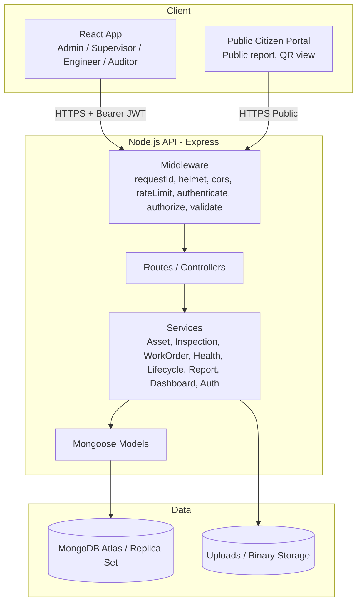

# Assetly: Infrastructure Asset Inventory & Lifecycle Platform

Assetly is a full-stack, enterprise-grade infrastructure asset inventory and lifecycle management platform built to track public assets (roads, streetlights, bridges, pipelines, drains, buildings) from **Planning to Disposal**.

---

## 🚀 Tech Stack

- **Backend**: Node.js 20, Express, Mongoose 8, MongoDB Atlas / Replica Set, Zod, JWT, bcryptjs, Helmet, Multer, node-cron
- **Frontend**: React 18, Vite, React Router DOM, TanStack Query, Zustand, Leaflet & React-Leaflet, Recharts, Lucide React, html5-qrcode
- **Styling**: Vanilla CSS with custom glassmorphism design system matching `asset-inventory-ui.html` tokens

---

## 🔐 Demo Credentials

| Role | Email | Password | Scope & Permissions |
|------|-------|----------|---------------------|
| **Admin** | `admin@demo.com` | `Admin@123` | Full organisation-wide access, user invite, asset retirement/disposal |
| **Supervisor** | `supervisor@demo.com` | `Super@123` | Wards 1 & 2 access, work order assignment & triage |
| **Engineer** | `engineer@demo.com` | `Engineer@123` | Ward 1 field inspection, asset registration, work order execution |
| **Auditor** | `auditor@demo.com` | `Audit@123` | Read-only compliance audit, cost trends, immutable security log |
| **Citizen** | `citizen@demo.com` | `Citizen@123` | Public issue reporting, QR asset lookup, report status tracking |

---

## 🛠️ Setup & Local Execution

### Prerequisites
- Node.js 20+
- MongoDB instance (local standalone, replica set, or MongoDB Atlas)

### Installation
```bash
# Install root dependencies
npm install

# Install backend dependencies
cd backend && npm install && cd ..

# Install frontend dependencies
cd frontend && npm install && cd ..
```

### Seed Demo Data
```bash
npm run seed
```

### Start Local Development (Backend + Frontend concurrently)
```bash
npm run dev
```
- Backend API running on `http://localhost:8000`
- Frontend React PWA running on `http://localhost:5173`

---

## 📐 System Architecture



---

## 📊 RBAC Permission Matrix Summary

| Resource / Permission | Admin | Supervisor | Engineer | Auditor | Citizen |
|-----------------------|:-----:|:----------:|:--------:|:-------:|:-------:|
| `user:read / invite / update` | org | ✗ | ✗ | user:read (org) | ✗ |
| `zone:manage` / `category:manage` | org | ✗ | ✗ | ✗ | ✗ |
| `asset:read` | org | zone | zone | org | public |
| `asset:create` | org | zone | zone | ✗ | ✗ |
| `asset:update` | org | zone | own (limited) | ✗ | ✗ |
| `asset:status:retire` | org | ✗ | ✗ | ✗ | ✗ |
| `inspection:create` | org | zone | zone | ✗ | ✗ |
| `workorder:assign` | org | zone | ✗ | ✗ | ✗ |
| `workorder:complete` | org | zone | own | ✗ | ✗ |
| `audit:read` | org | ✗ | ✗ | org | ✗ |

---

## ⚙️ Key Architectural Decisions ("Decisions Log")

1. **ES Module Ecosystem**: Configured `"type": "module"` across backend and frontend for modern JavaScript ES import syntax.
2. **Transaction Helper Fallback**: Built `withTransaction` helper supporting `USE_TRANSACTIONS=false` to execute steps seamlessly on standalone local MongoDB instances without requiring MongoDB replica set configuration.
3. **NoSQL Injection Defense**: Implemented `sanitize` middleware stripping keys starting with `$` or containing `.` from request body, query, and params.
4. **Token Security**: Access JWTs are stored only in Zustand in-memory state; refresh tokens are stored hashed in `sessions` collection with reuse detection and delivered in httpOnly, SameSite=Strict cookies.
5. **Exact Glassmorphism Design Tokens**: Reused CSS variables and glass recipes directly from `asset-inventory-ui.html` for a 1:1 visual match.
